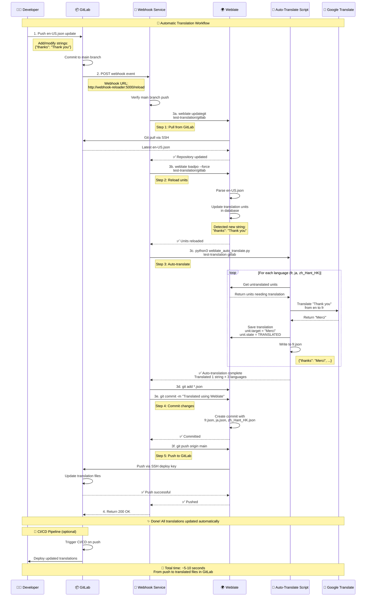
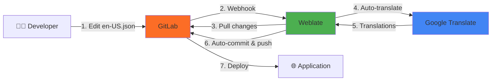
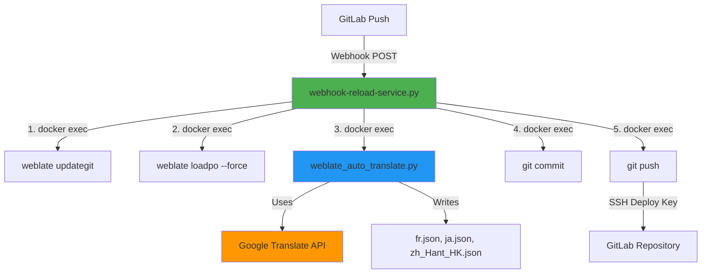

# Weblate + GitLab Auto-Setup

Automated setup for Weblate with GitLab integration and Google Translate for **automatic translation workflow**.

## Quick Start

This platform provides **fully automatic translation**:
1. Push changes to `en-US.json` in GitLab
2. Webhook automatically triggers Weblate
3. New strings are auto-translated via Google Translate
4. Translations are committed and pushed back to GitLab

**Total time: 5-10 seconds from push to translated files!**

## Setup Steps for Fresh Environment

### Prerequisites
- Docker and Docker Compose installed
- Google Cloud account with Translation API enabled
- 4GB RAM minimum, 8GB recommended

### Step-by-Step Setup

1. **Start the containers:**
   ```bash
   docker compose up -d
   ```

2. **Wait for initialization** (especially GitLab - can take 2-3 minutes)
   ```bash
   # Check GitLab status
   docker logs gitlab

   # GitLab is ready when you see "Reconfigured" messages
   ```

3. **Create .env file:**
   ```bash
   cp .env.template .env
   nano .env  # or your preferred editor
   ```

   **Required configuration values:**

   | Variable | Description | Example |
   |----------|-------------|---------|
   | `WEBLATE_MT_GOOGLE_KEY` | Google Translate API key ([Get one here](https://console.cloud.google.com/apis/credentials)) | `AIzaSyA...` |
   | `GITLAB_PROJECT_NAMESPACE` | GitLab namespace/group | `test` |
   | `GITLAB_PROJECT_NAME` | GitLab project name | `test-translation` |
   | `TARGET_LANGUAGES` | Languages to translate to (comma-separated) | `ja,fr,zh_Hant_HK` |
   | `GITLAB_API_TOKEN` | **Auto-generated by script** - leave empty initially | (leave empty) |

   **What is `GITLAB_API_TOKEN`?**
   - This is a GitLab Personal Access Token used by `auto-setup.sh` to **automatically create the webhook**
   - The script auto-generates this token during Step 12
   - It's saved to `.env` for future reference
   - **You don't need to create this manually** - just leave it empty in `.env.template`
   - Used only during setup, not during normal operation

4. **Create GitLab project manually:**
   ```bash
   # Open GitLab in browser
   open https://gitlab.local:8081/projects/new
   ```

   - Login with: `root` / `GITLAB_ROOT_PASSWORD` (from your `.env`)
   - Create blank project with name from `GITLAB_PROJECT_NAME`
   - Initialize with a translation file:
     ```bash
     # Clone the empty project
     git clone https://gitlab.local:8081/test/test-translation.git
     cd test-translation

     # Create initial translation file
     echo '{"welcome": "Welcome to app", "hello": "Hello"}' > en-US.json

     # Commit and push
     git add en-US.json
     git commit -m "Initial translation file"
     git push origin main
     ```

5. **Run auto-setup script:**
   ```bash
   ./auto-setup.sh
   ```

6. **What `auto-setup.sh` does automatically:**

   The script performs 12 steps:

   | Step | Action | Details |
   |------|--------|---------|
   | 1 | Extract SSH key | Gets Weblate's public SSH key |
   | 2 | Wait for GitLab project | Pauses for manual verification |
   | 3 | **Manual: Add deploy key** | **You must add SSH key to GitLab with write permissions** |
   | 4 | Setup SSH config | Configures Weblate's SSH for GitLab |
   | 5 | Create Weblate project | Creates project in Weblate |
   | 6 | Create component | Links to GitLab repository |
   | 7 | Enable auto-translate addon | Configures Google Translate |
   | 8 | Add target languages | Adds ja, fr, zh_Hant_HK, etc. |
   | 9 | Initial translation | Translates existing strings |
   | 10 | Push to GitLab | Commits translations to GitLab |
   | 11 | Fix SSH known_hosts | Ensures reliable Git operations |
   | 12 | **Create webhook** | **Auto-creates GitLab webhook using API token** |

   **Step 3 (Manual) - Add Deploy Key:**
   - When prompted, open the `weblate_ssh_key.pub` file
   - Go to GitLab: Project → Settings → Repository → Deploy Keys
   - Click "Add new key"
   - Title: `Weblate`
   - Key: Paste content from `weblate_ssh_key.pub`
   - **✓ Check "Grant write permissions"** (required for push)
   - Click "Add key"
   - Return to terminal and press Enter

   **Step 12 (Automatic) - Webhook Creation:**
   - Script automatically generates GitLab API token
   - Creates **TWO webhooks** in GitLab:
     - **Webhook 1**: `http://weblate:8080/hooks/gitlab/` - Notifies Weblate about GitLab pushes
     - **Webhook 2**: `http://webhook-reloader:5000/reload` - Triggers auto-translation workflow
   - Both webhooks trigger on push events
   - No manual intervention needed (unless token creation fails)

7. **Verify setup:**
   ```bash
   # Test the automatic workflow
   cd test-translation

   # Add a new string to en-US.json
   echo '{"welcome": "Welcome", "hello": "Hello", "thanks": "Thank you"}' > en-US.json

   # Push to GitLab
   git add en-US.json
   git commit -m "Add thanks string"
   git push

   # Watch webhook logs
   docker logs -f webhook-reloader

   # After 5-10 seconds, check GitLab for translated files
   git pull
   cat fr.json  # Should contain "Merci"
   cat ja.json  # Should contain "ありがとう"
   ```

## Duplicating Setup for Multiple Projects

Want to set up automatic translation for another project? Here's how:

### Option 1: Same Weblate Instance, New Project

Use the existing Weblate/GitLab containers for a new translation project:

1. **Create new GitLab project:**
   ```bash
   # Go to GitLab and create a new project
   # Example: "my-app-translation"
   ```

2. **Update .env for new project:**
   ```bash
   # Edit .env with new project details
   nano .env
   ```

   Update these values:
   ```bash
   GITLAB_PROJECT_NAMESPACE=mycompany
   GITLAB_PROJECT_NAME=my-app-translation
   GITLAB_REPO_URL=ssh://git@gitlab:22/mycompany/my-app-translation.git
   WEBLATE_PROJECT_NAME="My App Translation"
   WEBLATE_PROJECT_SLUG=my-app-translation
   WEBLATE_COMPONENT_NAME=main
   WEBLATE_COMPONENT_SLUG=main
   TARGET_LANGUAGES=ja,fr,de,es  # Customize languages
   ```

3. **Re-run auto-setup:**
   ```bash
   ./auto-setup.sh
   ```

   The script will:
   - Reuse the existing SSH key
   - Create new project in Weblate
   - Set up webhook for the new GitLab project
   - Configure auto-translation

4. **Add deploy key to new GitLab project:**
   - Use the same `weblate_ssh_key.pub`
   - Add to new project: Settings → Repository → Deploy Keys
   - Enable write permissions

### Option 2: Completely New Instance

For a separate, isolated translation platform:

1. **Clone the repository to new directory:**
   ```bash
   git clone <this-repo> /path/to/new-instance
   cd /path/to/new-instance
   ```

2. **Modify docker-compose.yml ports** (to avoid conflicts):
   ```yaml
   weblate:
     ports:
       - "8090:8080"  # Changed from 8080

   gitlab:
     ports:
       - "8091:80"    # Changed from 8081
       - "2223:22"    # Changed from 2222
   ```

3. **Create new .env file:**
   ```bash
   cp .env.template .env
   nano .env
   # Update all values for new instance
   ```

4. **Start containers and run setup:**
   ```bash
   docker compose up -d
   ./auto-setup.sh
   ```

### Option 3: Production Setup

For deploying to production with real domain names:

1. **Update .env with production values:**
   ```bash
   # Production domains
   WEBLATE_SITE_DOMAIN=weblate.yourcompany.com
   WEBLATE_ALLOWED_HOSTS=weblate.yourcompany.com
   WEBLATE_CSRF_TRUSTED_ORIGINS=https://weblate.yourcompany.com

   # Webhook URL (public HTTPS endpoint)
   WEBLATE_WEBHOOK_URL=https://weblate.yourcompany.com

   # Production security
   WEBLATE_DEBUG=0
   WEBLATE_SECRET_KEY=<generate-random-32-char-key>
   WEBLATE_ENABLE_HTTPS=1

   # Use production GitLab
   GITLAB_REPO_URL=git@gitlab.yourcompany.com:yournamespace/yourproject.git
   ```

2. **Set up SSL/TLS:**
   - Add reverse proxy (nginx/Caddy) for HTTPS
   - Configure SSL certificates (Let's Encrypt)
   - Update webhook URL to HTTPS endpoint

3. **Configure webhook service for production:**
   ```bash
   # Update webhook-reload-service.py with production URLs
   # Update docker-compose.yml with proper networking
   ```

4. **Run setup:**
   ```bash
   docker compose -f docker-compose.prod.yml up -d
   ./auto-setup.sh
   ```

## What It Does

The `auto-setup.sh` script automatically:
- ✅ Generates Weblate SSH key
- ✅ Creates Weblate project
- ✅ Connects to GitLab repository
- ✅ Adds all target languages
- ✅ Enables Google Translate auto-translation
- ✅ Translates existing strings
- ✅ Pushes translations to GitLab
- ✅ **Creates GitLab webhook for automatic translation workflow**
- ✅ **Configures webhook service to handle translations**
- ✅ **Fixes SSH known_hosts for reliable Git operations**

## Access

- **Weblate**: https://weblate.local:8080
- **GitLab**: https://gitlab.local:8081

## Automatic Translation Workflow

### Overview

When you push changes to `en-US.json` in GitLab, the system **automatically**:
1. ✅ Receives webhook notification from GitLab
2. ✅ Pulls latest changes from GitLab repository
3. ✅ Reloads translation units from updated `en-US.json`
4. ✅ Auto-translates new/changed strings using Google Translate
5. ✅ Commits and pushes translations back to GitLab

**Result:** Your translation files (fr.json, ja.json, zh_Hant_HK.json) are automatically updated in GitLab within seconds!

### Detailed Sequence Diagram



## System Architecture

### Components

The automatic translation workflow consists of several components:

1. **Webhook Service** (`webhook-reload-service.py`)
   - Flask HTTP server running on port 5000
   - Receives webhook notifications from GitLab
   - Orchestrates the complete translation workflow
   - Runs in Docker container: `webhook-reloader`

2. **Auto-Translate Script** (`weblate_auto_translate.py`)
   - Python Django script running inside Weblate container
   - Translates untranslated units using Google Translate API
   - Properly handles JSON nested format
   - Writes translations to JSON files
   - Updates Weblate statistics

3. **GitLab Webhooks** (Two webhooks required)
   - **Webhook 1**: `http://weblate:8080/hooks/gitlab/`
     - Notifies Weblate about GitLab pushes
     - Updates Weblate's UI and tracking state
   - **Webhook 2**: `http://webhook-reloader:5000/reload`
     - Triggers automatic translation workflow
     - Handles: pull → loadpo → auto-translate → commit → push
   - Both trigger on push events to main branch

4. **Weblate Container**
   - Stores translation units in PostgreSQL database
   - Manages VCS repository at `/app/data/vcs/test-translation/gitlab`
   - Provides CLI commands for git operations

### File Structure

```
myweblate/
├── docker-compose.yml              # Container orchestration
├── .env                            # Configuration (API keys, settings)
├── .env.template                   # Configuration template
├── auto-setup.sh                   # Initial setup script
├── webhook-reload-service.py       # Webhook service (main orchestrator)
├── weblate_auto_translate.py      # Auto-translation script
├── Dockerfile.webhook              # Webhook service Docker image
└── README.md                       # This file
```

### Modified/Added Files for Automatic Workflow

| File | Purpose | Key Features |
|------|---------|--------------|
| `webhook-reload-service.py` | Main webhook orchestrator | • Receives GitLab webhooks<br>• Triggers `weblate updategit`<br>• Runs `weblate loadpo --force`<br>• Executes auto-translate script<br>• Commits and pushes translations |
| `weblate_auto_translate.py` | Translation automation | • Connects to Weblate database<br>• Uses Google Translate API<br>• Translates untranslated units<br>• Saves to JSON files<br>• Updates statistics |
| `Dockerfile.webhook` | Webhook service image | • Based on Python 3.11<br>• Includes Docker CLI<br>• Runs Flask server |
| `docker-compose.yml` | Service configuration | • Added `webhook-reloader` service<br>• Network configuration<br>• Volume mounts for Docker socket |

## Bidirectional Sync Configuration

The integration supports **fully automatic bidirectional synchronization**:

### GitLab → Webhook Service → Weblate → Auto-translate → GitLab (Complete Cycle)

**How it works:**

1. **Developer pushes to GitLab** - Edit `en-US.json` and add new keys
   ```json
   {"welcome": "Welcome", "thanks": "Thank you"}
   ```

2. **GitLab triggers TWO webhooks simultaneously** ✓
   - **Webhook 1**: `http://weblate:8080/hooks/gitlab/`
     - Notifies Weblate about the push
     - Updates Weblate's internal tracking state
   - **Webhook 2**: `http://webhook-reloader:5000/reload`
     - Triggers the automatic translation workflow
     - Receives POST request with commit data

3. **Webhook Service orchestrates the workflow** ✓
   - **Step 1**: `weblate updategit` - Pull latest changes from GitLab
   - **Step 2**: `weblate loadpo --force` - Reload translation units from en-US.json
   - **Step 3**: `python3 weblate_auto_translate.py` - Auto-translate new strings
   - **Step 4**: `git commit` - Commit translation files
   - **Step 5**: `git push` - Push translations back to GitLab

4. **Auto-translate script processes each language** ✓
   - Queries Weblate database for untranslated units
   - Calls Google Translate API for each string
   - Saves translations to Weblate database
   - Writes JSON files (fr.json, ja.json, zh_Hant_HK.json)
   - Updates Weblate statistics

5. **Translations pushed back to GitLab** ✓
   - All language files committed in single commit
   - Pushed via SSH with deploy key
   - Commit message: "Translated using Weblate"

**Configuration details:**

- **GitLab Webhooks** (Two webhooks in GitLab):

  **Webhook 1** - Weblate Notification:
  - Location: GitLab Project → Settings → Webhooks
  - URL: `http://weblate:8080/hooks/gitlab/`
  - Purpose: Notifies Weblate about GitLab changes
  - Trigger: Push events
  - SSL verification: Disabled

  **Webhook 2** - Auto-Translation Workflow:
  - Location: GitLab Project → Settings → Webhooks
  - URL: `http://webhook-reloader:5000/reload`
  - Purpose: Triggers automatic translation pipeline
  - Trigger: Push events (main branch only)
  - SSL verification: Disabled

- **Deploy Key with Write Permissions** (Weblate → GitLab):
  - Manually added during setup
  - Allows Weblate to push translations back to GitLab
  - Location: GitLab Project → Settings → Repository → Deploy Keys

- **Webhook Service**:
  - Docker container name: `webhook-reloader`
  - Network: `myweblate_weblate-network`
  - Port: 5000 (internal)
  - Access to Docker socket for executing commands in Weblate container

**Result:** Complete hands-off workflow - edit source file in GitLab, translations appear automatically in GitLab within 5-10 seconds!

## Auto-Translation

When enabled, translations happen automatically when:
- New languages are added
- New strings are pushed to GitLab
- Source strings are modified

Translations are committed and **automatically pushed back to GitLab** without manual intervention.

## Troubleshooting

### Automatic translation not working when I push to GitLab

1. **Check webhook service is running:**
   ```bash
   # Check if webhook-reloader container is running
   docker ps | grep webhook-reloader

   # Check webhook service logs
   docker logs webhook-reloader --tail 50
   ```

2. **Check GitLab webhook configuration:**
   ```bash
   # List webhooks for your project (replace with your GitLab API token)
   source .env
   docker exec gitlab curl -sk --header "PRIVATE-TOKEN: $GITLAB_API_TOKEN" \
     "http://localhost/api/v4/projects/test%2Ftest-translation/hooks"
   ```

   The webhook should point to: `http://webhook-reloader:5000/reload`

3. **Test webhook manually:**
   ```bash
   # Test webhook endpoint
   docker exec gitlab curl -X POST http://webhook-reloader:5000/reload \
     -H "Content-Type: application/json" \
     -d '{"ref":"refs/heads/main"}'
   ```

   Expected response: `{"status": "success", "message": "Units reloaded, auto-translation triggered"}`

4. **Check auto-translate script is available:**
   ```bash
   # Verify script exists in Weblate container
   docker exec weblate ls -la /app/data/weblate_auto_translate.py

   # Test script manually
   docker exec weblate python3 /app/data/weblate_auto_translate.py test-translation gitlab
   ```

5. **Check Google Translate API key:**
   ```bash
   # Verify API key is set in Weblate container
   docker exec weblate bash -c 'echo $WEBLATE_MT_GOOGLE_KEY'
   ```

6. **View detailed webhook logs:**
   ```bash
   # Follow webhook logs in real-time
   docker logs -f webhook-reloader

   # Then push a change to GitLab and watch the logs
   ```

### Translations not appearing in GitLab after auto-translation

1. **Check if translations were created in Weblate:**
   ```bash
   # Check translation files in Weblate's VCS directory
   docker exec weblate cat /app/data/vcs/test-translation/gitlab/fr.json
   docker exec weblate cat /app/data/vcs/test-translation/gitlab/ja.json
   ```

2. **Check git status in Weblate:**
   ```bash
   docker exec weblate bash -c "cd /app/data/vcs/test-translation/gitlab && git status"
   docker exec weblate bash -c "cd /app/data/vcs/test-translation/gitlab && git log --oneline -5"
   ```

3. **Manually push if needed:**
   ```bash
   docker exec weblate bash -c "cd /app/data/vcs/test-translation/gitlab && git push origin main"
   ```

### Weblate not updating when I push to GitLab (Legacy)

1. **Check SSH known_hosts:**
   ```bash
   # If you see "Host key verification failed", run:
   docker exec weblate bash -c 'ssh-keyscan -p 22 gitlab > /app/data/ssh/known_hosts 2>/dev/null && chmod 600 /app/data/ssh/known_hosts'
   ```

2. **Test git pull manually:**
   ```bash
   # Trigger manual update
   docker exec weblate weblate updategit test-translation/gitlab
   ```

### GitLab not receiving Weblate translations

1. **Verify deploy key has write permissions:**
   - Go to: `https://gitlab.local:8081/test/test-translation/-/settings/repository`
   - Check "Deploy Keys" section
   - Ensure "Write access enabled" is checked

2. **Check SSH configuration:**
   ```bash
   docker exec weblate cat /app/data/ssh/config
   ```

## Architecture



**Complete automatic cycle:**
1. Push source file to GitLab
2. GitLab webhook notifies Weblate
3. Weblate pulls changes
4. Weblate auto-translates via Google Translate
5. Weblate commits and pushes translations back to GitLab
6. All language files available in GitLab

## Files

### Core Files
- `.env.template` - Configuration template with all required settings
- `.env` - Your local configuration (generated from template)
- `auto-setup.sh` - Initial setup script for Weblate project creation
- `docker-compose.yml` - Docker services configuration (Weblate, GitLab, PostgreSQL, Redis, webhook service)
- `weblate_ssh_key.pub` - Generated SSH key (add to GitLab as deploy key with write permissions)

### Automatic Translation Workflow Files
- `webhook-reload-service.py` - **Main webhook orchestrator** that handles GitLab webhooks and coordinates the complete workflow
- `weblate_auto_translate.py` - **Auto-translation script** that translates strings using Google Translate API and saves to JSON files
- `Dockerfile.webhook` - Docker image definition for webhook service (Python + Docker CLI + Flask)

### How They Work Together


