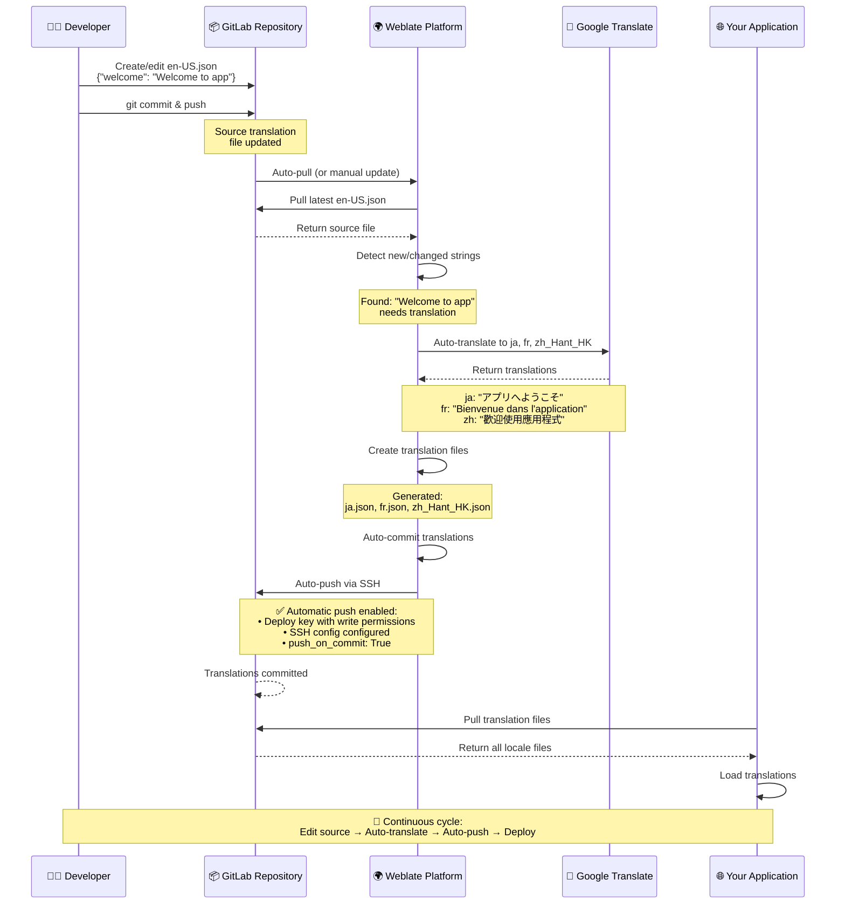

# Weblate + GitLab Auto-Setup

Automated setup for Weblate with GitLab integration and Google Translate.

## Setup Steps for Fresh Environment

1. **Start the containers:**
   ```bash
   docker compose up -d
   ```

2. **Wait for initialization** (especially GitLab - can take 2-3 minutes)
   - Check GitLab status: `docker logs gitlab`
   - GitLab is ready when you see "Reconfigured" messages

3. **Create .env file:**
   ```bash
   cp .env.template .env
   nano .env
   ```

   Update these values in `.env`:
   - `WEBLATE_MT_GOOGLE_KEY` - Your Google Translate API key
   - `GITLAB_PROJECT_NAMESPACE` - GitLab namespace (e.g., "test")
   - `GITLAB_PROJECT_NAME` - GitLab project name (e.g., "test-translation")
   - `TARGET_LANGUAGES` - Languages to translate to (e.g., "ja,fr,zh_Hant_HK")

4. **Create GitLab project manually:**
   - Open https://gitlab.local:8081/projects/new
   - Login with root / `GITLAB_ROOT_PASSWORD` from .env
   - Create project with name from `GITLAB_PROJECT_NAME`
   - Add initial translation file (e.g., `en-US.json` with `{"welcome": "Welcome to app"}`)

5. **Run auto-setup:**
   ```bash
   ./auto-setup.sh
   ```

6. **During script execution:**
   - **Step 1**: The script extracts Weblate's SSH public key and saves it to `weblate_ssh_key.pub`
     - This is the same key visible at https://weblate.local:8080/manage/ssh/
     - Weblate automatically generates this key when first started

   - **Step 2**: When prompted, verify your GitLab project exists and press Enter

   - **Step 3**: Add the SSH key to GitLab as a deploy key:
     - Open the generated `weblate_ssh_key.pub` file (or copy from https://weblate.local:8080/manage/ssh/)
     - Go to GitLab: your project → Settings → Repository → Deploy Keys → Expand
     - Click "Add new key"
     - Title: `Weblate`
     - Key: Paste the content from `weblate_ssh_key.pub`
     - **Important**: Check "Grant write permissions"
     - Click "Add key"
     - Return to terminal and press Enter to continue

## What It Does

The script automatically:
- ✅ Generates Weblate SSH key
- ✅ Creates Weblate project
- ✅ Connects to GitLab repository
- ✅ Adds all target languages
- ✅ Enables Google Translate auto-translation
- ✅ Translates existing strings
- ✅ Pushes translations to GitLab

## Access

- **Weblate**: https://weblate.local:8080
- **GitLab**: https://gitlab.local:8081

## Translation Workflow



## Automatic Push Configuration

Weblate automatically pushes translations back to GitLab because:

1. **Deploy key has write permissions** ✓
   - Location: GitLab UI (Project → Settings → Repository → Deploy Keys)
   - Configured manually during auto-setup.sh Step 3

2. **SSH config is properly configured** ✓
   - Location: `/app/data/ssh/config` inside Weblate container
   - Created by: `auto-setup.sh` Step 4
   - Verify: `docker exec weblate cat /app/data/ssh/config`

3. **Component has `push_on_commit: True`** ✓
   - Location: Weblate database (PostgreSQL)
   - Set by: `auto-setup.sh` Step 6
   - Verify: Check at https://weblate.local:8080/projects/test-translation/gitlab/

## Auto-Translation

When enabled, translations happen automatically when:
- New languages are added
- New strings are pushed to GitLab
- Source strings are modified

Translations are committed and **automatically pushed back to GitLab** without manual intervention.

## Files

- `.env.template` - Configuration template
- `auto-setup.sh` - Automated project setup
- `docker-compose.yml` - Docker services
- `weblate_ssh_key.pub` - Generated SSH key (add to GitLab)
