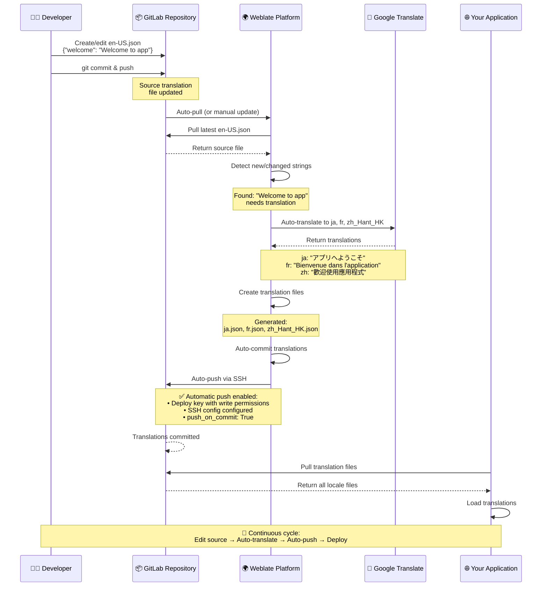
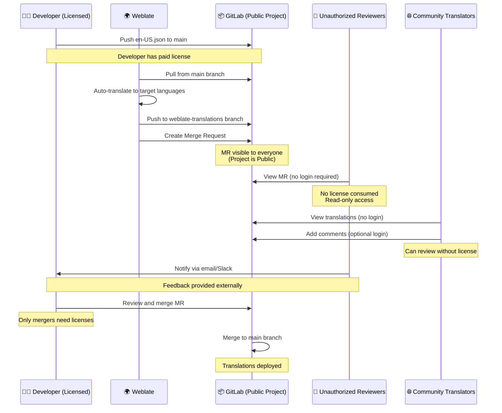

# Weblate + GitLab Auto-Setup

Automated setup for Weblate with GitLab integration and Google Translate.

## Setup Steps for Fresh Environment

1. **Start the containers:**
   ```bash
   docker compose up -d
   ```

2. **Wait for initialization** (especially GitLab - can take 2-3 minutes)
   - Check GitLab status: `docker logs gitlab`
   - GitLab is ready when you see "Reconfigured" messages

3. **Create .env file:**
   ```bash
   cp .env.template .env
   nano .env
   ```

   Update these values in `.env`:
   - `WEBLATE_MT_GOOGLE_KEY` - Your Google Translate API key
   - `GITLAB_PROJECT_NAMESPACE` - GitLab namespace (e.g., "test")
   - `GITLAB_PROJECT_NAME` - GitLab project name (e.g., "test-translation")
   - `TARGET_LANGUAGES` - Languages to translate to (e.g., "ja,fr,zh_Hant_HK")
   - `PUSH_ON_COMMIT` - Set to `true` to auto-push translations, `false` for manual review (default: `true`)

4. **Create GitLab project manually:**
   - Open https://gitlab.local:8081/projects/new
   - Login with root / `GITLAB_ROOT_PASSWORD` from .env
   - Create project with name from `GITLAB_PROJECT_NAME`
   - Add initial translation file (e.g., `en-US.json` with `{"welcome": "Welcome to app"}`)

5. **Run auto-setup:**
   ```bash
   ./auto-setup.sh
   ```

6. **During script execution:**
   - **Step 1**: The script extracts Weblate's SSH public key and saves it to `weblate_ssh_key.pub`
     - This is the same key visible at https://weblate.local:8080/manage/ssh/
     - Weblate automatically generates this key when first started

   - **Step 2**: When prompted, verify your GitLab project exists and press Enter

   - **Step 3**: Add the SSH key to GitLab as a deploy key:
     - Open the generated `weblate_ssh_key.pub` file (or copy from https://weblate.local:8080/manage/ssh/)
     - Go to GitLab: your project → Settings → Repository → Deploy Keys → Expand
     - Click "Add new key"
     - Title: `Weblate`
     - Key: Paste the content from `weblate_ssh_key.pub`
     - **Important**: Check "Grant write permissions"
     - Click "Add key"
     - Return to terminal and press Enter to continue

## What It Does

The script automatically:
- ✅ Generates Weblate SSH key
- ✅ Creates Weblate project
- ✅ Connects to GitLab repository
- ✅ Adds all target languages
- ✅ Enables Google Translate auto-translation
- ✅ Translates existing strings
- ✅ Pushes translations to GitLab

## Access

- **Weblate**: https://weblate.local:8080
- **GitLab**: https://gitlab.local:8081

## Translation Workflow



## Automatic Push Configuration

Weblate automatically pushes translations back to GitLab because:

1. **Deploy key has write permissions** ✓
   - Location: GitLab UI (Project → Settings → Repository → Deploy Keys)
   - Configured manually during auto-setup.sh Step 3

2. **SSH config is properly configured** ✓
   - Location: `/app/data/ssh/config` inside Weblate container
   - Created by: `auto-setup.sh` Step 4
   - Verify: `docker exec weblate cat /app/data/ssh/config`

3. **Component has `push_on_commit: True`** ✓
   - Location: Weblate database (PostgreSQL)
   - Configured by: `PUSH_ON_COMMIT` in `.env` (default: `true`)
   - Set by: `auto-setup.sh` Step 6
   - Verify: Check at https://weblate.local:8080/projects/test-translation/gitlab/

## Auto-Translation

When enabled, translations happen automatically when:
- New languages are added
- New strings are pushed to GitLab
- Source strings are modified

Translations are committed and **automatically pushed back to GitLab** without manual intervention.

## Switching to Merge Request Mode

If you want Weblate to **create GitLab merge requests** instead of automatically pushing to the main branch, you have several options:

### Option 1: Configure via .env (For Fresh Installations)

Set `PUSH_ON_COMMIT=false` in your `.env` file before running `auto-setup.sh`:

```bash
PUSH_ON_COMMIT=false
```

This disables automatic pushing, so translations will be committed locally but not pushed. You can then configure merge request creation via the Weblate UI (see Option 2).

### Option 2: Configure via Weblate UI (Easiest)

1. Open: https://weblate.local:8080/projects/test-translation/gitlab/settings/
2. Scroll to **"Repository maintenance"** or **"Version control"** section
3. Find these settings:
   - **Uncheck** "Push on commit" (disable auto-push)
   - Set **"Merge style"** to: `GitLab merge request`
   - Set **"Push branch"**: `weblate-translations` (branch name for MRs)
4. Scroll to **"GitLab integration"**:
   - Add your GitLab instance URL: `https://gitlab.local:8081`
   - Add GitLab API token (generate from GitLab user settings)
5. Click **Save**

### Option 3: Modify auto-setup.sh Directly (Advanced)

If you need full merge request workflow with automatic MR creation, edit `auto-setup.sh` to add merge request settings:

```python
push_on_commit = '${PUSH_ON_COMMIT}'.lower() == 'true'

component, created = Component.objects.get_or_create(
    project=project,
    slug='${WEBLATE_COMPONENT_SLUG}',
    defaults={
        'name': '${WEBLATE_COMPONENT_NAME}',
        'repo': '${GITLAB_REPO_URL}',
        'branch': '${GITLAB_BRANCH}',
        'filemask': '${FILE_MASK}',
        'file_format': '${FILE_FORMAT}',
        'new_base': '${NEW_BASE}',
        'vcs': 'git',
        'push_on_commit': push_on_commit,  # Controlled by PUSH_ON_COMMIT env var
        'commit_pending_age': 24,
        'merge_style': 'gitlab',           # Add this for GitLab merge requests
        'push_branch': 'weblate-translations',  # Add this for separate branch
    }
)
```

**Workflow after this change:**
1. Weblate translates strings
2. Weblate commits to `weblate-translations` branch
3. Weblate creates a merge request from `weblate-translations` → `main`
4. You review and manually merge the MR in GitLab

## Allowing Unauthorized Users to View Merge Requests

### Scenario

You have a limited number of GitLab paid user licenses, but you want unauthorized users (reviewers, translators, stakeholders) to view Weblate-generated translation merge requests without consuming licenses.

### Solution: Set GitLab Project to Public Visibility

**Configuration Steps:**

1. Open GitLab project settings: https://gitlab.local:8081/test/test-translation/-/edit
2. Under **"Visibility, project features, permissions"**:
   - Set **"Project visibility"** to: `Public`
   - Enable **"Merge requests"** visibility: `Everyone`
3. Save changes

**What this achieves:**
- Anyone can view merge requests without GitLab login
- No license seats consumed for viewers
- Write/merge permissions still restricted to project members
- Weblate continues to push using SSH deploy key

### Workflow with Public Access



**Key Benefits:**
- ✅ Unlimited viewers without license costs
- ✅ Translation files publicly reviewable
- ✅ Community can provide feedback
- ✅ Only authorized users can merge
- ✅ Weblate automation continues to work

**Security Considerations:**
- Translation files and file structure are publicly visible
- Repository code/structure is viewable by anyone
- No one can push/merge without being a project member
- Suitable for non-sensitive translation content

## Files

- `.env.template` - Configuration template
- `auto-setup.sh` - Automated project setup
- `docker-compose.yml` - Docker services
- `weblate_ssh_key.pub` - Generated SSH key (add to GitLab)
