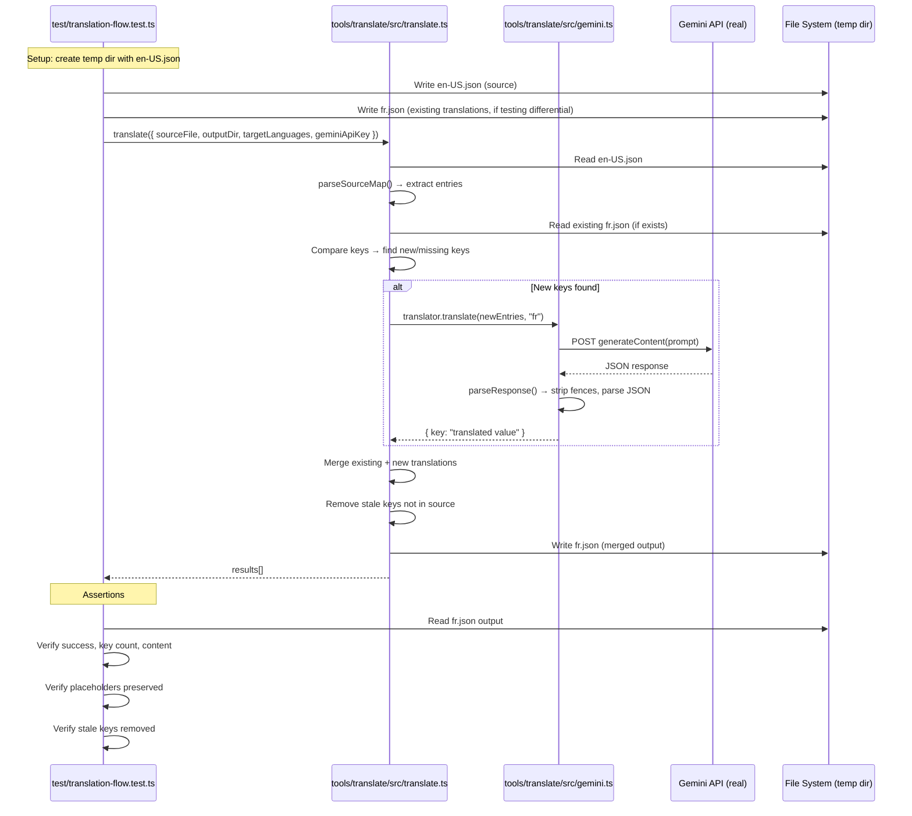
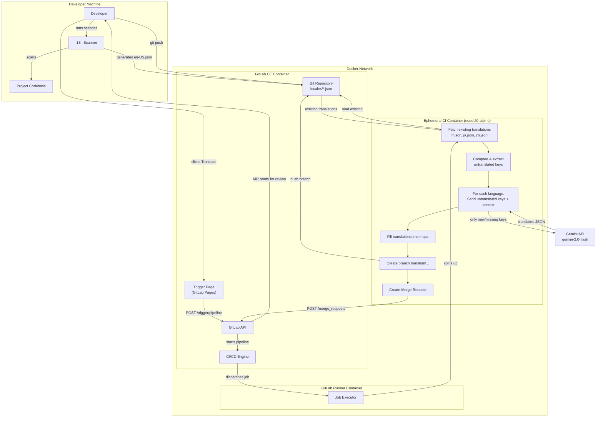
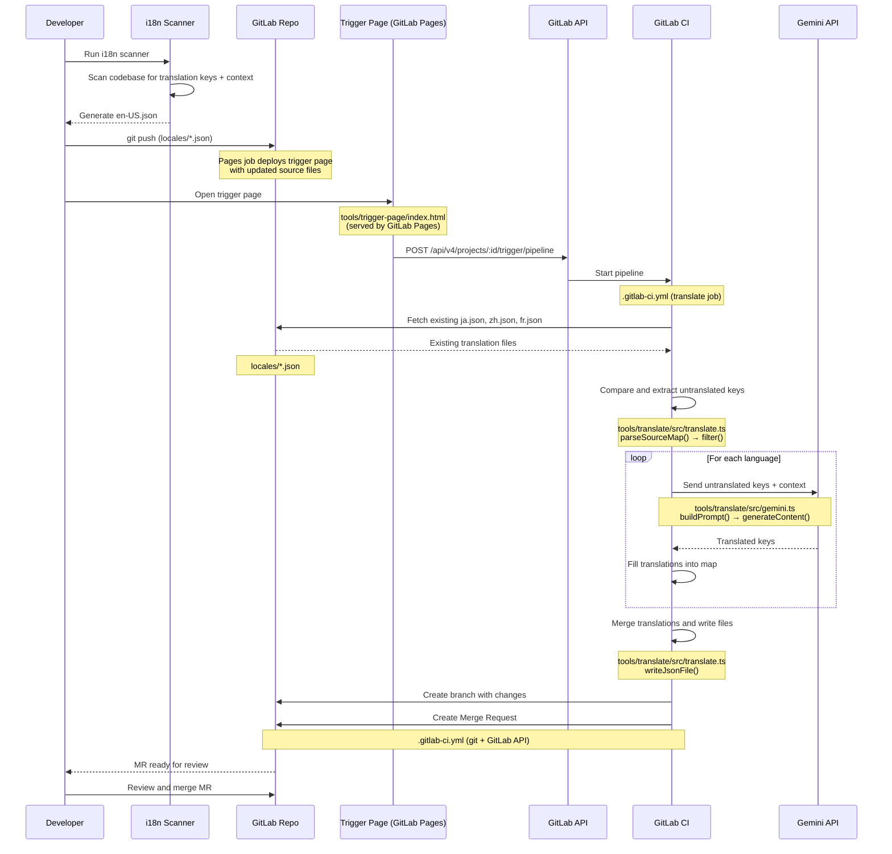

# GitLab + Gemini Auto-Translation


A self-hosted translation platform using GitLab CI and Gemini AI. Trigger context-aware translations from a web UI, review via Merge Requests.

## How It Works

```
Push en-US.json → GitLab Pages updates trigger UI
Click "Translate" on trigger page → GitLab CI → Gemini API → Merge Request with fr.json, ja.json, etc.
```

**Key features:**
- Context-aware translations using Gemini AI
- Static trigger page hosted on GitLab Pages (no separate server)
- Only translates new/missing keys (cost-efficient)
- Creates Merge Requests for review before merging

---

## Quick Start

### Step 1. Configure environment

```bash
cp .env.template .env
nano .env  # Set GITLAB_ROOT_PASSWORD and GEMINI_API_KEY
```

### Step 2. Start the Docker containers

```bash
docker compose up -d
```

Wait 2-3 minutes for GitLab to initialize. You can check progress with `docker logs -f gitlab`.

### Step 3. Create a project in GitLab

1. Open https://gitlab.local:8081
2. Login: `root` / your password from `.env`
3. Create a new project (e.g. `translation-demo`)

### Step 4. Register the GitLab Runner

```bash
# Get registration token from GitLab Admin > CI/CD > Runners
docker exec -it gitlab-runner gitlab-runner register
```

When prompted:
- **GitLab URL**: `https://gitlab.local:8081`
- **Registration token**: from the GitLab admin page
- **Executor**: `docker`
- **Default image**: `node:20-alpine`

### Step 5. Add the Gemini API key as a CI/CD variable

1. Go to your project > Settings > CI/CD > Variables
2. Add a new variable:
   - **Key**: `GEMINI_API_KEY`
   - **Value**: your Gemini API key
   - **Protected**: No (so it works on all branches)
   - **Masked**: Yes

This is required because the CI translate job runs inside an ephemeral container that cannot read the host `.env` file.

### Step 6. Generate translation source file and push

Run your project's i18n scanner to extract translation keys and context from the codebase. The scanner generates `locales/en-US.json` — a single file where each key maps to `{ value, context }`:

```bash
# Run your i18n scanner (project-specific)
# This generates locales/en-US.json

git add .
git commit -m "Initial commit with translation files"
git push origin main
```

This triggers the `pages` job in CI, which deploys the trigger page to GitLab Pages.

### Step 7. Create a Pipeline Trigger Token

1. Go to your project > Settings > CI/CD > Pipeline triggers
2. Click **Add trigger** and give it a description (e.g. "Translation trigger page")
3. Copy the token — you'll need it in the next step

### Step 8. Open the trigger page and configure

1. Open the trigger page at `http://gitlab.local:8084/<group>/<project>` (e.g. `http://gitlab.local:8084/root/translation-demo`)
2. The **Settings** panel will be expanded on first visit. Fill in:
   - **GitLab URL**: `https://gitlab.local:8081`
   - **Project ID**: your project's numeric ID (visible on the project homepage)
   - **Pipeline Trigger Token**: the token from Step 7
   - **Ref / Branch**: `main`
3. Click **Save Settings** (stored in your browser's localStorage)

### Step 9. Trigger translation

1. Verify the **Source Keys** table shows your `en-US.json` keys
2. Set **Target Languages** (default: `fr,ja,zh-Hant-HK`)
3. Click **Translate**
4. The page shows a link to the triggered pipeline — click it to monitor progress
5. When the pipeline completes, a **Merge Request** appears in your project with the translated files
6. Review the MR and merge

### Running a translation after adding new keys

1. Re-run the i18n scanner to regenerate `locales/en-US.json` with the new keys
2. Push the changes — the `pages` job updates the trigger page automatically
3. Open the trigger page — you'll see the updated source keys
4. Click **Translate** — only the new/missing keys are sent to Gemini (existing translations are preserved)
5. Review and merge the new MR

---

## Translation Files

Generated by your project's i18n scanner, which extracts translation keys and their context annotations from the source code.

### `en-US.json` - Source File

Each key maps to a `{ value, context }` object:

```json
{
  "submit": { "value": "Submit", "context": "Primary action button on forms" },
  "cancel": { "value": "Cancel", "context": "Button to close dialogs without saving" },
  "errorTimeout": { "value": "Connection timed out. Please try again.", "context": "Error message when API fails, tone should be apologetic" },
  "itemCount": { "value": "{count} items", "context": "Shows item count in cart, {count} is a placeholder" }
}
```

| Field | Description |
|-------|-------------|
| `value` | The source English string to translate |
| `context` | Description of how/where the string is used — helps Gemini pick the right translation |

**Context is optional** — keys without context still get translated, just with less accuracy.

### Missing Context Warnings

When CI detects keys without context, it logs warnings:

```
--- Missing Context Warning ---
The following 2 keys have no context:
  - newKey
  - anotherKey
Add context to your i18n annotations for better translation quality.
```

Translation still proceeds (soft mode).

---

## Configuration

### Environment Variables

| Variable | Description | Required |
|----------|-------------|----------|
| `GEMINI_API_KEY` | Your Gemini API key | Yes |
| `TARGET_LANGUAGES` | Languages to translate to (e.g., `fr,ja,zh-Hant-HK`) | Yes |
| `GITLAB_ROOT_PASSWORD` | GitLab root password | Yes |

### Getting a Gemini API Key

1. Go to https://aistudio.google.com/app/apikey
2. Create a new API key
3. Add to `.env` file

---

## Project Structure

```
.
├── docker-compose.yml      # GitLab + GitLab Runner
├── .env.template           # Configuration template
├── .gitlab-ci.yml          # CI pipeline for translation
├── setup.sh                # Initial setup script
├── .github/workflows/
│   └── test.yml            # GitHub Actions: runs tests on every push/PR
├── test/                   # E2E tests (proves Gemini translation flow works)
│   ├── package.json
│   ├── vitest.config.ts
│   └── translation-flow.test.ts
├── locales/
│   ├── en-US.json          # Source strings with context ({ value, context } per key)
│   ├── fr.json             # Generated: French translations
│   ├── ja.json             # Generated: Japanese translations
│   └── zh-Hant-HK.json     # Generated: Chinese (Traditional) translations
└── tools/
    ├── translate/          # TypeScript translation tool
    │   ├── package.json
    │   ├── tsconfig.json
    │   ├── vitest.config.ts
    │   └── src/
    │       ├── index.ts    # Entry point
    │       ├── translate.ts # Core logic
    │       ├── gemini.ts   # Gemini API wrapper
    │       ├── types.ts    # TypeScript types
    │       └── __tests__/
    │           ├── gemini.test.ts      # Unit tests for prompt/response parsing
    │           ├── translate.test.ts   # Unit tests for translation logic
    │           └── integration.test.ts # Integration test (requires API key)
    └── trigger-page/       # Static UI served by GitLab Pages
        └── index.html      # Trigger page (settings + source keys + pipeline trigger)
```

### File Descriptions

| File | Function |
|------|----------|
| `docker-compose.yml` | Defines the Docker services: GitLab CE (git hosting + CI engine) and GitLab Runner (executes CI jobs) |
| `.env.template` | Template for environment variables: `GITLAB_ROOT_PASSWORD`, `GEMINI_API_KEY`, `TARGET_LANGUAGES` |
| `.gitlab-ci.yml` | CI pipeline definition — `test` job runs unit tests on every push, `pages` job deploys trigger UI to GitLab Pages, `translate` job runs the translation tool and creates a Merge Request |
| `setup.sh` | One-time setup script: copies `.env.template`, validates API key, starts Docker containers |
| `locales/en-US.json` | Source English strings with context (`{ value, context }` per key) — the single source of truth for all translations |
| `locales/{lang}.json` | Generated translation files (e.g. `fr.json`, `ja.json`) — output of the translation pipeline |
| `tools/translate/src/index.ts` | CLI entry point — reads environment variables, resolves file paths, calls `translate()`, prints summary |
| `tools/translate/src/translate.ts` | Core translation orchestrator — reads source and existing translations, compares keys, sends only new/missing keys to Gemini, merges results, writes output files |
| `tools/translate/src/gemini.ts` | Gemini API wrapper — builds translation prompts with key/value/context, calls `generateContent()`, parses JSON response |
| `tools/translate/src/types.ts` | TypeScript type definitions: `SourceEntry`, `SourceMap`, `TranslationMap`, `MergedEntry`, `TranslateOptions`, `TranslationResult` |
| `tools/translate/src/__tests__/gemini.test.ts` | Unit tests for `buildPrompt()` and `parseResponse()` — verifies prompt construction, JSON parsing, and markdown fence stripping |
| `tools/translate/src/__tests__/translate.test.ts` | Unit tests for `parseSourceMap()` and `translate()` — verifies differential translation, stale key removal, and merge logic (mocked Gemini) |
| `tools/translate/src/__tests__/integration.test.ts` | Integration test — calls real Gemini API with minimal payload, skipped when `GEMINI_API_KEY` is not set |
| `tools/trigger-page/index.html` | Static single-page web UI hosted by GitLab Pages — displays source keys, stores GitLab connection settings in localStorage, triggers translation pipeline via Pipeline Trigger API |
| `test/translation-flow.test.ts` | E2E test — proves the full Gemini translation flow works: simple labels, placeholder preservation, ICU plural format, multi-key requests, and file I/O. Requires `GEMINI_API_KEY`. |
| `.github/workflows/test.yml` | GitHub Actions workflow — runs unit tests on every push/PR, runs e2e tests if `GEMINI_API_KEY` secret is configured |

---

## Commands

```bash
# Start GitLab
docker compose up -d

# Stop GitLab
docker compose down

# View GitLab logs
docker logs -f gitlab

# View Runner logs
docker logs -f gitlab-runner

# Run unit tests (no API key needed)
cd tools/translate && npm install && npm test

# Run e2e tests (proves Gemini flow works, requires API key)
cd test && npm install && GEMINI_API_KEY=your_key npm test

# Run translation locally
cd tools/translate && npm install
GEMINI_API_KEY=your_key TARGET_LANGUAGES=fr,ja npm run translate
```

---

## Tests

The project has two levels of tests: **unit tests** (no API key, run fast with mocked Gemini) and **e2e tests** (require API key, call real Gemini API).

### Unit Tests (`tools/translate/src/__tests__/`)

Test the internal logic without calling the Gemini API. Gemini is mocked — these run in ~150ms.

| File | Test | What it proves |
|------|------|----------------|
| `gemini.test.ts` | parses clean JSON | `parseResponse()` returns correct object from raw JSON |
| `gemini.test.ts` | strips \`\`\`json fences | `parseResponse()` handles Gemini wrapping response in markdown code blocks |
| `gemini.test.ts` | strips bare \`\`\` fences | `parseResponse()` handles Gemini wrapping response without `json` tag |
| `gemini.test.ts` | throws on invalid JSON | `parseResponse()` gives a clear error when Gemini returns garbage |
| `gemini.test.ts` | handles whitespace around JSON | `parseResponse()` trims whitespace before parsing |
| `gemini.test.ts` | includes key, value, and context | `buildPrompt()` constructs prompt with all entry fields for Gemini |
| `gemini.test.ts` | omits context line when undefined | `buildPrompt()` skips context for keys without it |
| `gemini.test.ts` | includes multiple entries | `buildPrompt()` handles batch of keys in one prompt |
| `translate.test.ts` | parses entries with value and context | `parseSourceMap()` correctly reads combined `{ value, context }` format |
| `translate.test.ts` | detects keys with missing context | `parseSourceMap()` identifies keys without context for warnings |
| `translate.test.ts` | handles empty source map | `parseSourceMap()` returns empty arrays for empty input |
| `translate.test.ts` | translates all keys when no existing file | `translate()` sends all keys to Gemini and writes output file |
| `translate.test.ts` | only translates new keys | `translate()` skips existing keys and only sends missing ones to Gemini |
| `translate.test.ts` | skips when all keys translated | `translate()` never calls Gemini when nothing is new |
| `translate.test.ts` | removes stale keys not in source | `translate()` cleans up keys deleted from `en-US.json` |
| `translate.test.ts` | handles multiple target languages | `translate()` produces output files for each language |

### E2E Tests (`test/`)

Call the **real `translate()` function** with the **real Gemini API**. These prove the actual pipeline works end-to-end. Skipped when `GEMINI_API_KEY` is not set.

| Test | What it proves |
|------|----------------|
| translates all keys from source file to French | Full pipeline: `translate()` reads `en-US.json` → calls Gemini → writes `fr.json` with valid translations |
| preserves {name} placeholder | `{name}` placeholder survives the Gemini round-trip intact |
| preserves ICU plural format | `{count, plural, one {...} other {...}}` ICU syntax survives translation |
| only translates new keys (differential) | Existing `fr.json` with "submit" is kept; only missing "cancel" is sent to Gemini |
| removes stale keys no longer in source | Key removed from `en-US.json` is deleted from `fr.json` output |
| translates to multiple languages | `translate()` produces both `fr.json` and `ja.json`; Japanese contains CJK characters |

### E2E Test Flow



---

## Memory Usage

| Service | Memory | Notes |
|---------|--------|-------|
| GitLab | ~1.5-2GB | Main service |
| GitLab Runner | ~128MB | Runs CI jobs |
| **Total** | **~2GB** | Much lighter than before |

---

## GitHub Actions (Auto-Test on Every Commit)

The project includes a GitHub Actions workflow (`.github/workflows/test.yml`) that runs automatically on every push and pull request to `main`.

**What runs:**
- **Unit tests** — always run (no API key needed), validates translation logic
- **E2E tests** — only run if `GEMINI_API_KEY` secret is configured, proves the real Gemini flow works

**To enable e2e tests on GitHub:**
1. Go to your GitHub repo > Settings > Secrets and variables > Actions
2. Click **New repository secret**
3. Name: `GEMINI_API_KEY`, Value: your Gemini API key

---

## Troubleshooting

### GitLab not starting

```bash
docker logs gitlab
# Wait for "Reconfigured" messages (2-3 minutes)
```

### Runner not picking up jobs

```bash
# Check runner status
docker exec gitlab-runner gitlab-runner list

# Re-register if needed
docker exec -it gitlab-runner gitlab-runner register
```

### Translation failing

```bash
# Check CI job logs in GitLab UI
# Or test locally:
cd tools/translate
npm run translate
```

---

## Architecture

### System Diagram



### Sequence Diagram



### Pipeline Stages

| Stage | Description | File(s) |
|-------|-------------|---------|
| **Test** | On every push, runs unit tests for the translation tool (prompt building, response parsing, differential translation logic). Skipped when pipeline is triggered via API. Integration tests are skipped in CI (no API key). | `.gitlab-ci.yml` (`test` job), `tools/translate/src/__tests__/*.test.ts` |
| **Deploy (Pages)** | On every push, copies `index.html` and source locale files to GitLab Pages. The trigger page is updated automatically. Does not run when pipeline is triggered via API. | `.gitlab-ci.yml` (`pages` job), `tools/trigger-page/index.html` |
| **Trigger** | Developer clicks the Translate button on the trigger page hosted by GitLab Pages. The page calls the Pipeline Trigger API directly from the browser. This is the only entry point — translation is never auto-triggered by git push, to control Gemini API costs. | `tools/trigger-page/index.html` |
| **Dispatch** | GitLab CI engine dispatches the translate job to the Runner, which spins up an ephemeral `node:20-alpine` container. | `.gitlab-ci.yml` |
| **Fetch existing** | For each target language, reads the existing translation file (e.g. `fr.json`) from the repository. Returns `{}` if the file doesn't exist yet. | `tools/translate/src/translate.ts` — `readJsonFile()` |
| **Compare & extract** | Parses source entries (value + context), then compares against existing translations. Only keys that are missing from the existing file are marked for translation. | `tools/translate/src/translate.ts` — `parseSourceMap()`, `entries.filter()` |
| **Translate** | For each language, sends only the untranslated keys (with their values and context) to the Gemini API. Languages with no new keys are skipped entirely. | `tools/translate/src/gemini.ts` — `buildPrompt()`, `translate()` |
| **Merge & write** | Merges new translations over existing ones (`{ ...existing, ...new }`), removes keys that no longer exist in source, and writes the output file. | `tools/translate/src/translate.ts` — `writeJsonFile()` |
| **Branch & MR** | Creates a new git branch (`translate/YYYYMMDD-HHMMSS`), commits the changed locale files, pushes the branch, and creates a Merge Request via the GitLab API with `remove_source_branch=true`. | `.gitlab-ci.yml` — git commands + `curl` to GitLab API |
| **Review** | Developer receives the MR, reviews the translation diff, and merges. | GitLab UI |

---

## Version

**Version:** 4.0.0
**Changes from 3.x:**
- Migrated trigger page from standalone Node.js server to GitLab Pages
- Removed `server.ts` — page calls GitLab Pipeline Trigger API directly
- Added differential translation (only new/missing keys sent to Gemini)
- Translation creates Merge Requests instead of direct pushes

---

**Need help?** Check the troubleshooting section or open an issue.
