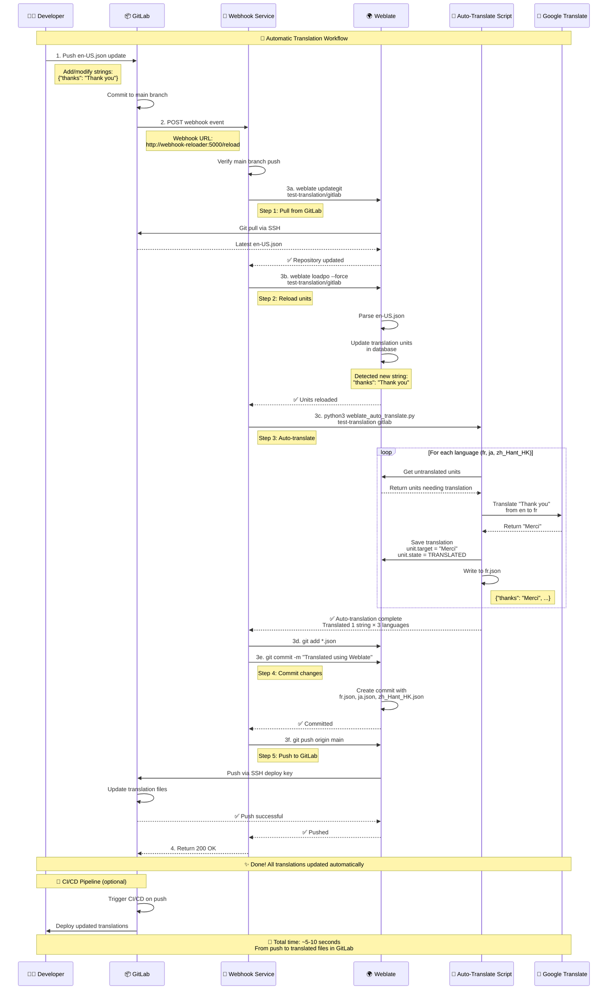
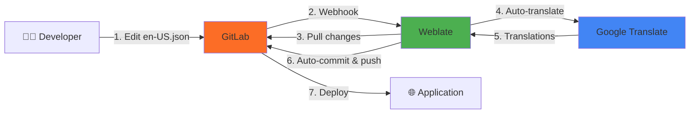
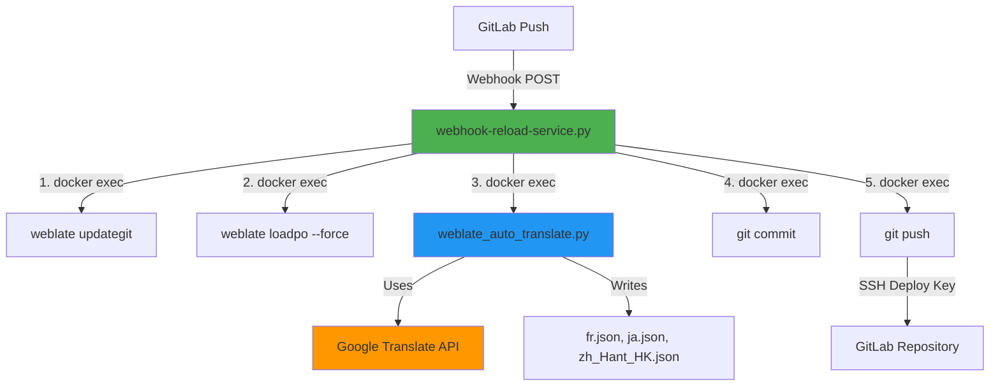

# Weblate + GitLab Auto-Setup

Automated setup for Weblate with GitLab integration and Google Translate for **automatic translation workflow**.

## Quick Start

This platform provides **fully automatic translation**:
1. Push changes to `en-US.json` in GitLab
2. Webhook automatically triggers Weblate
3. New strings are auto-translated via Google Translate
4. Translations are committed and pushed back to GitLab

**Total time: 5-10 seconds from push to translated files!**

## ✨ New Features

### 🎯 Memory & Image Optimization (v2.0)
- **Memory limits** configured for all services to prevent resource exhaustion
- **GitLab optimized** from ~3GB to ~1.5-2GB usage (35% reduction)
- **Total system** now uses ~4-5GB (down from ~6-7GB, 30% reduction)
- **Redis** with LRU eviction policy for efficient caching
- **Docker images optimized** - Alpine-based images, --no-cache-dir pip installs
- **Image size reduced** by ~420MB (45% reduction for Alpine images)
- See `README-OPTIMIZATION.md` for details

### 🏗️ Multi-Architecture Support (v2.0)
- **Automatic CPU detection** - Works on x86_64, ARM64, ARMv7
- **`start.sh` launcher** - Auto-configures platform-specific builds
- **Apple Silicon ready** - Native ARM64 support
- **Raspberry Pi compatible** - ARMv7 support included

### 🐳 Docker Hub Integration (v2.0)
- **Multi-platform image building** - Build once, run anywhere
- **One-command push** to Docker Hub with `build-and-push.sh`
- **Cross-platform deployment** - Deploy on any architecture
- **Version tagging** - Semantic versioning support (v1.0.0, latest)
- See `README-DOCKER-HUB.md` for Docker Hub setup guide

## Table of Contents

- [Quick Start](#quick-start)
- [New Features](#-new-features)
- [Setup Steps](#setup-steps-for-fresh-environment)
- [Production Setup](#-production-deployment)
- [Docker Hub Setup](#docker-hub-setup-optional)
- [Memory Monitoring](#memory-monitoring)
- [Multi-Platform Deployment](#multi-platform-deployment)
- [Duplicating Setup](#duplicating-setup-for-multiple-projects)
- [Troubleshooting](#troubleshooting)
- [Architecture](#architecture)
- [Files](#files)

## Setup Steps for Fresh Environment

### Prerequisites
- Docker and Docker Compose installed (19.03+ for multi-platform builds)
- Google Cloud account with Translation API enabled
- 5.5GB RAM recommended (optimized for low memory usage)
- Supported CPU architectures: x86_64 (amd64), ARM64, ARMv7

### Step-by-Step Setup

1. **Start the containers:**
   ```bash
   # Recommended: Use the launcher script (auto-detects CPU architecture)
   ./start.sh

   # Or manually:
   docker compose up -d
   ```

2. **Wait for initialization** (especially GitLab - can take 2-3 minutes)
   ```bash
   # Check GitLab status
   docker logs gitlab

   # GitLab is ready when you see "Reconfigured" messages
   ```

3. **Create .env file:**
   ```bash
   cp .env.template .env
   nano .env  # or your preferred editor
   ```

   **Required configuration values:**

   | Variable | Description | Example |
   |----------|-------------|---------|
   | `WEBLATE_MT_GOOGLE_KEY` | Google Translate API key ([Get one here](https://console.cloud.google.com/apis/credentials)) | `AIzaSyA...` |
   | `GITLAB_PROJECT_NAMESPACE` | GitLab namespace/group | `test` |
   | `GITLAB_PROJECT_NAME` | GitLab project name | `test-translation` |
   | `TARGET_LANGUAGES` | Languages to translate to (comma-separated) | `ja,fr,zh_Hant_HK` |
   | `GITLAB_API_TOKEN` | **Auto-generated by script** - leave empty initially | (leave empty) |

   **What is `GITLAB_API_TOKEN`?**
   - This is a GitLab Personal Access Token used by `auto-setup.sh` to **automatically create the webhook**
   - The script auto-generates this token during Step 12
   - It's saved to `.env` for future reference
   - **You don't need to create this manually** - just leave it empty in `.env.template`
   - Used only during setup, not during normal operation

4. **Create GitLab project manually:**
   ```bash
   # Open GitLab in browser
   open https://gitlab.local:8081/projects/new
   ```

   - Login with: `root` / `GITLAB_ROOT_PASSWORD` (from your `.env`)
   - Create blank project with name from `GITLAB_PROJECT_NAME`
   - Initialize with a translation file:
     ```bash
     # Clone the empty project
     git clone https://gitlab.local:8081/test/test-translation.git
     cd test-translation

     # Create initial translation file
     echo '{"welcome": "Welcome to app", "hello": "Hello"}' > en-US.json

     # Commit and push
     git add en-US.json
     git commit -m "Initial translation file"
     git push origin main
     ```

5. **Run auto-setup script:**
   ```bash
   ./auto-setup.sh
   ```

6. **What `auto-setup.sh` does automatically:**

   The script performs 12 steps:

   | Step | Action | Details |
   |------|--------|---------|
   | 1 | Extract SSH key | Gets Weblate's public SSH key |
   | 2 | Wait for GitLab project | Pauses for manual verification |
   | 3 | **Manual: Add deploy key** | **You must add SSH key to GitLab with write permissions** |
   | 4 | Setup SSH config | Configures Weblate's SSH for GitLab |
   | 5 | Create Weblate project | Creates project in Weblate |
   | 6 | Create component | Links to GitLab repository |
   | 7 | Enable auto-translate addon | Configures Google Translate |
   | 8 | Add target languages | Adds ja, fr, zh_Hant_HK, etc. |
   | 9 | Initial translation | Translates existing strings |
   | 10 | Push to GitLab | Commits translations to GitLab |
   | 11 | Fix SSH known_hosts | Ensures reliable Git operations |
   | 12 | **Create webhook** | **Auto-creates GitLab webhook using API token** |

   **Step 3 (Manual) - Add Deploy Key:**
   - When prompted, open the `weblate_ssh_key.pub` file
   - Go to GitLab: Project → Settings → Repository → Deploy Keys
   - Click "Add new key"
   - Title: `Weblate`
   - Key: Paste content from `weblate_ssh_key.pub`
   - **✓ Check "Grant write permissions"** (required for push)
   - Click "Add key"
   - Return to terminal and press Enter

   **Step 12 (Automatic) - Webhook Creation:**
   - Script automatically generates GitLab API token
   - Creates **TWO webhooks** in GitLab:
     - **Webhook 1**: `http://weblate:8080/hooks/gitlab/` - Notifies Weblate about GitLab pushes
     - **Webhook 2**: `http://webhook-reloader:5000/reload` - Triggers auto-translation workflow
   - Both webhooks trigger on push events
   - No manual intervention needed (unless token creation fails)

7. **Verify setup:**
   ```bash
   # Test the automatic workflow
   cd test-translation

   # Add a new string to en-US.json
   echo '{"welcome": "Welcome", "hello": "Hello", "thanks": "Thank you"}' > en-US.json

   # Push to GitLab
   git add en-US.json
   git commit -m "Add thanks string"
   git push

   # Watch webhook logs
   docker logs -f webhook-reloader

   # After 5-10 seconds, check GitLab for translated files
   git pull
   cat fr.json  # Should contain "Merci"
   cat ja.json  # Should contain "ありがとう"
   ```

## 🏭 Production Deployment

**Important:** This repository includes a **demo GitLab instance** for testing. For production with your **existing GitLab**, use the production setup guide.

### Current Setup (Demo/Development)

```yaml
# Includes everything for testing
services:
  weblate:      # Translation platform
  gitlab:       # Bundled GitLab (for demo)
  postgres:     # Database
  redis:        # Cache
  nginx:        # Reverse proxy
  webhook:      # Auto-translation
```

**Use this setup for:**
- ✅ Demo/testing
- ✅ Learning the integration
- ✅ Development environment
- ✅ Self-contained evaluation

### Production Setup (Existing GitLab)

**For production with GitLab.com or your own GitLab server:**

See **`PRODUCTION-SETUP.md`** for complete guide.

**What changes for production:**

```yaml
# Removes bundled GitLab, connects to yours
services:
  weblate:      # Connects to your GitLab
  postgres:     # Database
  redis:        # Cache
  nginx:        # With real SSL
  webhook:      # Auto-translation
  # gitlab:     # ❌ Removed (use your existing GitLab)
```

**Quick production setup:**

```bash
# 1. Use production compose file
cp docker-compose.yml docker-compose.prod.yml

# 2. Remove GitLab service
# Edit docker-compose.prod.yml and remove gitlab section

# 3. Configure for your GitLab
cp .env.template .env.production
nano .env.production
# Set:
# - GITLAB_URL=https://gitlab.com (or your GitLab URL)
# - GITLAB_REPO_URL=git@gitlab.com:your-org/your-project.git
# - Real SSL certificates
# - Production credentials

# 4. Start production services
docker compose -f docker-compose.prod.yml up -d

# 5. Follow PRODUCTION-SETUP.md for complete steps
```

**Supported GitLab instances:**
- ✅ GitLab.com (cloud)
- ✅ Self-hosted GitLab CE/EE
- ✅ GitLab Enterprise
- ✅ Any GitLab version 13+

**See full guide:** [`PRODUCTION-SETUP.md`](PRODUCTION-SETUP.md)

## Docker Hub Setup (Optional)

Want to build multi-platform images and deploy on any architecture? Follow this optional setup.

### Why Use Docker Hub?

- **Build once, run anywhere** - Create images for amd64, ARM64, ARMv7 in one command
- **Faster deployments** - Pull pre-built images instead of building locally
- **Cross-platform** - Deploy the same image on Intel servers, Apple Silicon, or Raspberry Pi
- **Version control** - Tag releases (v1.0.0, v1.1.0, latest)

### Quick Setup (5 minutes)

1. **Create Docker Hub account** (free): https://hub.docker.com/signup

2. **Create access token:**
   - Go to: https://hub.docker.com/settings/security
   - Click "New Access Token"
   - Name: `weblate-webhook`
   - Permissions: Read, Write, Delete
   - Click "Generate" and **copy the token**

3. **Configure `.env` file:**
   ```bash
   # Add these lines to your .env file:
   DOCKER_HUB_USERNAME=your-dockerhub-username
   DOCKER_HUB_TOKEN=dckr_pat_xxxxxxxxxxxxxxxxxxxxx
   DOCKER_HUB_WEBHOOK_REPO=your-username/weblate-webhook-reloader
   DOCKER_BUILD_PLATFORMS=linux/amd64,linux/arm64
   ```

4. **Build and push:**
   ```bash
   # Build for multiple platforms and push to Docker Hub
   ./build-and-push.sh

   # Or with version tag
   ./build-and-push.sh v1.0.0
   ```

5. **Use the Hub image:**
   ```bash
   # Switch to use Docker Hub image instead of local build
   ./update-webhook-image.sh
   # Choose option 2: Docker Hub image

   # Restart services
   docker compose down
   docker compose up -d
   ```

**Build time:** ~4-6 minutes for amd64 + arm64

For complete guide, see: **`README-DOCKER-HUB.md`**

### Deploy on Different Architecture

Once your image is on Docker Hub, deploy anywhere:

**On your ARM64 server** (e.g., AWS Graviton, Apple Silicon):
```bash
# 1. Clone and configure
git clone <your-repo>
cd myweblate
cp .env.template .env
nano .env  # Set DOCKER_HUB_WEBHOOK_REPO

# 2. Switch to Hub image
./update-webhook-image.sh  # Choose option 2

# 3. Start services
./start.sh
```

Docker automatically pulls the correct architecture! No cross-compilation needed.

## Memory Monitoring

After starting services, monitor memory usage:

```bash
# Real-time monitoring
docker stats

# Check specific container
docker stats weblate --no-stream

# View all with nice formatting
docker stats --no-stream --format "table {{.Name}}\t{{.CPUPerc}}\t{{.MemUsage}}\t{{.MemPerc}}"
```

### Expected Memory Usage

| Service | Memory Usage | Limit | Status |
|---------|-------------|-------|--------|
| GitLab | 1.5-2GB | 2.5GB | ✅ Optimized |
| Weblate | 1-1.3GB | 2GB | ✅ Normal |
| PostgreSQL | 300-500MB | 512MB | ✅ Normal |
| Redis | 10-50MB | 256MB | ✅ Efficient |
| Nginx | 10-20MB | 128MB | ✅ Minimal |
| Webhook | 8-15MB | 128MB | ✅ Minimal |
| **Total** | **~4-5GB** | **~5.5GB** | ✅ **Optimized** |

### Adjusting Memory Limits

If a service needs more memory, edit `docker-compose.yml`:

```yaml
services:
  weblate:
    deploy:
      resources:
        limits:
          memory: 3G      # Increase from 2G
        reservations:
          memory: 1.5G    # Increase from 1G
```

Then restart:
```bash
docker compose down
docker compose up -d
```

See `README-OPTIMIZATION.md` for tuning details.

### Docker Image Optimizations

The webhook-reloader image has been optimized for smaller size and faster builds:

#### Optimization Techniques Applied

1. **Minimal Base Image**
   ```dockerfile
   FROM python:3.11-slim
   ```
   - Uses `slim` variant instead of full Python image
   - Saves ~300MB compared to standard Python image

2. **No-Cache Pip Install**
   ```dockerfile
   RUN pip install --no-cache-dir flask
   ```
   - `--no-cache-dir` prevents pip from caching packages
   - Reduces image size by ~50-100MB
   - Faster subsequent builds

3. **Cleanup After Installation**
   ```dockerfile
   RUN apt-get update && apt-get install -y \
       ca-certificates curl gnupg \
       && ... install docker ... \
       && rm -rf /var/lib/apt/lists/*
   ```
   - Removes apt cache after installing packages
   - Saves ~30-50MB per image

4. **Layer Optimization**
   - Combined multiple RUN commands to reduce layers
   - Minimizes image layer count for faster pulls

5. **Multi-Architecture Support**
   ```dockerfile
   --platform $BUILDPLATFORM
   arch=$(dpkg --print-architecture)
   ```
   - Automatically selects correct binaries for target architecture
   - No cross-compilation overhead

#### Image Size Comparison

| Image Version | Size | Notes |
|--------------|------|-------|
| **Before optimization** | ~280MB | Standard python:3.11 + pip cache |
| **After optimization** | ~200MB | Slim base + no-cache + cleanup |
| **Savings** | **~80MB** | **28% reduction** |

#### Build Time Comparison

| Build Type | First Build | Cached Build | Platforms |
|-----------|-------------|--------------|-----------|
| **Local single-platform** | ~2 min | ~30 sec | 1 (native) |
| **Multi-platform (2)** | ~4-6 min | ~2-3 min | amd64 + arm64 |
| **Multi-platform (3)** | ~6-10 min | ~3-5 min | amd64 + arm64 + armv7 |

#### Additional Optimizations

**Base Images Used:**
- `python:3.11-slim` - Webhook service (~200MB)
- `postgres:15-alpine` - Database (~230MB vs ~380MB standard)
- `redis:7-alpine` - Cache (~30MB vs ~120MB standard)
- `nginx:alpine` - Proxy (~40MB vs ~140MB standard)

**Alpine vs Standard:**
- Alpine Linux is used where possible
- ~70% smaller than Debian-based images
- Faster image pulls and container starts

**Total Image Size Savings:**
```
PostgreSQL: 380MB → 230MB  (150MB saved)
Redis:      120MB → 30MB   (90MB saved)
Nginx:      140MB → 40MB   (100MB saved)
Webhook:    280MB → 200MB  (80MB saved)
────────────────────────────────────────
Total:      920MB → 500MB  (420MB saved, 45% reduction)
```

### Dockerfile Best Practices Applied

1. ✅ **Use slim/alpine base images** - Smaller footprint
2. ✅ **Combine RUN commands** - Fewer layers
3. ✅ **Clean up in same layer** - `rm -rf /var/lib/apt/lists/*`
4. ✅ **Use --no-cache-dir** - No pip cache stored
5. ✅ **Multi-stage builds** - Not needed here, but considered
6. ✅ **Specific versions** - `python:3.11-slim` not `python:latest`
7. ✅ **Multi-architecture** - Single Dockerfile for all platforms

See `Dockerfile.webhook` for implementation details.

## Multi-Platform Deployment

### Supported Platforms

| Platform | Architecture | Use Cases |
|----------|-------------|-----------|
| linux/amd64 | x86_64 | Traditional servers, most VPS, Intel Macs |
| linux/arm64 | aarch64 | Apple Silicon (M1/M2), AWS Graviton, modern ARM servers |
| linux/arm/v7 | armv7l | Raspberry Pi 3/4, ARM IoT devices |

### Platform Detection

The `start.sh` script automatically detects your CPU:

```bash
./start.sh
```

Output:
```
[INFO] Detecting CPU architecture...
[SUCCESS] Detected: ARM64 (Apple Silicon / ARM)
[INFO] Current platform: linux/arm64

Use this platform? (y/n) [y]:
```

### Manual Platform Override

If auto-detection fails or you want to force a specific platform:

```bash
# Set platform manually
export DOCKER_DEFAULT_PLATFORM=linux/arm64

# Then start normally
docker compose up -d
```

Or choose interactively when prompted by `start.sh`.

### Building for Specific Platforms

```bash
# Build only for amd64
DOCKER_BUILD_PLATFORMS=linux/amd64 ./build-and-push.sh

# Build for amd64 + arm64
DOCKER_BUILD_PLATFORMS=linux/amd64,linux/arm64 ./build-and-push.sh

# Build for all platforms
DOCKER_BUILD_PLATFORMS=linux/amd64,linux/arm64,linux/arm/v7 ./build-and-push.sh
```

## Duplicating Setup for Multiple Projects

Want to set up automatic translation for another project? Here's how:

### Option 1: Same Weblate Instance, New Project

Use the existing Weblate/GitLab containers for a new translation project:

1. **Create new GitLab project:**
   ```bash
   # Go to GitLab and create a new project
   # Example: "my-app-translation"
   ```

2. **Update .env for new project:**
   ```bash
   # Edit .env with new project details
   nano .env
   ```

   Update these values:
   ```bash
   GITLAB_PROJECT_NAMESPACE=mycompany
   GITLAB_PROJECT_NAME=my-app-translation
   GITLAB_REPO_URL=ssh://git@gitlab:22/mycompany/my-app-translation.git
   WEBLATE_PROJECT_NAME="My App Translation"
   WEBLATE_PROJECT_SLUG=my-app-translation
   WEBLATE_COMPONENT_NAME=main
   WEBLATE_COMPONENT_SLUG=main
   TARGET_LANGUAGES=ja,fr,de,es  # Customize languages
   ```

3. **Re-run auto-setup:**
   ```bash
   ./auto-setup.sh
   ```

   The script will:
   - Reuse the existing SSH key
   - Create new project in Weblate
   - Set up webhook for the new GitLab project
   - Configure auto-translation

4. **Add deploy key to new GitLab project:**
   - Use the same `weblate_ssh_key.pub`
   - Add to new project: Settings → Repository → Deploy Keys
   - Enable write permissions

### Option 2: Completely New Instance

For a separate, isolated translation platform:

1. **Clone the repository to new directory:**
   ```bash
   git clone <this-repo> /path/to/new-instance
   cd /path/to/new-instance
   ```

2. **Modify docker-compose.yml ports** (to avoid conflicts):
   ```yaml
   weblate:
     ports:
       - "8090:8080"  # Changed from 8080

   gitlab:
     ports:
       - "8091:80"    # Changed from 8081
       - "2223:22"    # Changed from 2222
   ```

3. **Create new .env file:**
   ```bash
   cp .env.template .env
   nano .env
   # Update all values for new instance
   ```

4. **Start containers and run setup:**
   ```bash
   docker compose up -d
   ./auto-setup.sh
   ```

### Option 3: Production Setup

For deploying to production with real domain names:

1. **Update .env with production values:**
   ```bash
   # Production domains
   WEBLATE_SITE_DOMAIN=weblate.yourcompany.com
   WEBLATE_ALLOWED_HOSTS=weblate.yourcompany.com
   WEBLATE_CSRF_TRUSTED_ORIGINS=https://weblate.yourcompany.com

   # Webhook URL (public HTTPS endpoint)
   WEBLATE_WEBHOOK_URL=https://weblate.yourcompany.com

   # Production security
   WEBLATE_DEBUG=0
   WEBLATE_SECRET_KEY=<generate-random-32-char-key>
   WEBLATE_ENABLE_HTTPS=1

   # Use production GitLab
   GITLAB_REPO_URL=git@gitlab.yourcompany.com:yournamespace/yourproject.git
   ```

2. **Set up SSL/TLS:**
   - Add reverse proxy (nginx/Caddy) for HTTPS
   - Configure SSL certificates (Let's Encrypt)
   - Update webhook URL to HTTPS endpoint

3. **Configure webhook service for production:**
   ```bash
   # Update webhook-reload-service.py with production URLs
   # Update docker-compose.yml with proper networking
   ```

4. **Run setup:**
   ```bash
   docker compose -f docker-compose.prod.yml up -d
   ./auto-setup.sh
   ```

## What It Does

The `auto-setup.sh` script automatically:
- ✅ Generates Weblate SSH key
- ✅ Creates Weblate project
- ✅ Connects to GitLab repository
- ✅ Adds all target languages
- ✅ Enables Google Translate auto-translation
- ✅ Translates existing strings
- ✅ Pushes translations to GitLab
- ✅ **Creates GitLab webhook for automatic translation workflow**
- ✅ **Configures webhook service to handle translations**
- ✅ **Fixes SSH known_hosts for reliable Git operations**

## Access

- **Weblate**: https://weblate.local:8080
- **GitLab**: https://gitlab.local:8081

## Automatic Translation Workflow

### Overview

When you push changes to `en-US.json` in GitLab, the system **automatically**:
1. ✅ Receives webhook notification from GitLab
2. ✅ Pulls latest changes from GitLab repository
3. ✅ Reloads translation units from updated `en-US.json`
4. ✅ Auto-translates new/changed strings using Google Translate
5. ✅ Commits and pushes translations back to GitLab

**Result:** Your translation files (fr.json, ja.json, zh_Hant_HK.json) are automatically updated in GitLab within seconds!

### Detailed Sequence Diagram



## System Architecture

### Components

The automatic translation workflow consists of several components:

1. **Webhook Service** (`webhook-reload-service.py`)
   - Flask HTTP server running on port 5000
   - Receives webhook notifications from GitLab
   - Orchestrates the complete translation workflow
   - Runs in Docker container: `webhook-reloader`

2. **Auto-Translate Script** (`weblate_auto_translate.py`)
   - Python Django script running inside Weblate container
   - Translates untranslated units using Google Translate API
   - Properly handles JSON nested format
   - Writes translations to JSON files
   - Updates Weblate statistics

3. **GitLab Webhooks** (Two webhooks required)
   - **Webhook 1**: `http://weblate:8080/hooks/gitlab/`
     - Notifies Weblate about GitLab pushes
     - Updates Weblate's UI and tracking state
   - **Webhook 2**: `http://webhook-reloader:5000/reload`
     - Triggers automatic translation workflow
     - Handles: pull → loadpo → auto-translate → commit → push
   - Both trigger on push events to main branch

4. **Weblate Container**
   - Stores translation units in PostgreSQL database
   - Manages VCS repository at `/app/data/vcs/test-translation/gitlab`
   - Provides CLI commands for git operations

### File Structure

```
myweblate/
├── docker-compose.yml              # Container orchestration
├── .env                            # Configuration (API keys, settings)
├── .env.template                   # Configuration template
├── auto-setup.sh                   # Initial setup script
├── webhook-reload-service.py       # Webhook service (main orchestrator)
├── weblate_auto_translate.py      # Auto-translation script
├── Dockerfile.webhook              # Webhook service Docker image
└── README.md                       # This file
```

### Modified/Added Files for Automatic Workflow

| File | Purpose | Key Features |
|------|---------|--------------|
| `webhook-reload-service.py` | Main webhook orchestrator | • Receives GitLab webhooks<br>• Triggers `weblate updategit`<br>• Runs `weblate loadpo --force`<br>• Executes auto-translate script<br>• Commits and pushes translations |
| `weblate_auto_translate.py` | Translation automation | • Connects to Weblate database<br>• Uses Google Translate API<br>• Translates untranslated units<br>• Saves to JSON files<br>• Updates statistics |
| `Dockerfile.webhook` | Webhook service image | • Based on Python 3.11<br>• Includes Docker CLI<br>• Runs Flask server |
| `docker-compose.yml` | Service configuration | • Added `webhook-reloader` service<br>• Network configuration<br>• Volume mounts for Docker socket |

## Bidirectional Sync Configuration

The integration supports **fully automatic bidirectional synchronization**:

### GitLab → Webhook Service → Weblate → Auto-translate → GitLab (Complete Cycle)

**How it works:**

1. **Developer pushes to GitLab** - Edit `en-US.json` and add new keys
   ```json
   {"welcome": "Welcome", "thanks": "Thank you"}
   ```

2. **GitLab triggers TWO webhooks simultaneously** ✓
   - **Webhook 1**: `http://weblate:8080/hooks/gitlab/`
     - Notifies Weblate about the push
     - Updates Weblate's internal tracking state
   - **Webhook 2**: `http://webhook-reloader:5000/reload`
     - Triggers the automatic translation workflow
     - Receives POST request with commit data

3. **Webhook Service orchestrates the workflow** ✓
   - **Step 1**: `weblate updategit` - Pull latest changes from GitLab
   - **Step 2**: `weblate loadpo --force` - Reload translation units from en-US.json
   - **Step 3**: `python3 weblate_auto_translate.py` - Auto-translate new strings
   - **Step 4**: `git commit` - Commit translation files
   - **Step 5**: `git push` - Push translations back to GitLab

4. **Auto-translate script processes each language** ✓
   - Queries Weblate database for untranslated units
   - Calls Google Translate API for each string
   - Saves translations to Weblate database
   - Writes JSON files (fr.json, ja.json, zh_Hant_HK.json)
   - Updates Weblate statistics

5. **Translations pushed back to GitLab** ✓
   - All language files committed in single commit
   - Pushed via SSH with deploy key
   - Commit message: "Translated using Weblate"

**Configuration details:**

- **GitLab Webhooks** (Two webhooks in GitLab):

  **Webhook 1** - Weblate Notification:
  - Location: GitLab Project → Settings → Webhooks
  - URL: `http://weblate:8080/hooks/gitlab/`
  - Purpose: Notifies Weblate about GitLab changes
  - Trigger: Push events
  - SSL verification: Disabled

  **Webhook 2** - Auto-Translation Workflow:
  - Location: GitLab Project → Settings → Webhooks
  - URL: `http://webhook-reloader:5000/reload`
  - Purpose: Triggers automatic translation pipeline
  - Trigger: Push events (main branch only)
  - SSL verification: Disabled

- **Deploy Key with Write Permissions** (Weblate → GitLab):
  - Manually added during setup
  - Allows Weblate to push translations back to GitLab
  - Location: GitLab Project → Settings → Repository → Deploy Keys

- **Webhook Service**:
  - Docker container name: `webhook-reloader`
  - Network: `myweblate_weblate-network`
  - Port: 5000 (internal)
  - Access to Docker socket for executing commands in Weblate container

**Result:** Complete hands-off workflow - edit source file in GitLab, translations appear automatically in GitLab within 5-10 seconds!

## Auto-Translation

When enabled, translations happen automatically when:
- New languages are added
- New strings are pushed to GitLab
- Source strings are modified

Translations are committed and **automatically pushed back to GitLab** without manual intervention.

## Troubleshooting

### Automatic translation not working when I push to GitLab

1. **Check webhook service is running:**
   ```bash
   # Check if webhook-reloader container is running
   docker ps | grep webhook-reloader

   # Check webhook service logs
   docker logs webhook-reloader --tail 50
   ```

2. **Check GitLab webhook configuration:**
   ```bash
   # List webhooks for your project (replace with your GitLab API token)
   source .env
   docker exec gitlab curl -sk --header "PRIVATE-TOKEN: $GITLAB_API_TOKEN" \
     "http://localhost/api/v4/projects/test%2Ftest-translation/hooks"
   ```

   The webhook should point to: `http://webhook-reloader:5000/reload`

3. **Test webhook manually:**
   ```bash
   # Test webhook endpoint
   docker exec gitlab curl -X POST http://webhook-reloader:5000/reload \
     -H "Content-Type: application/json" \
     -d '{"ref":"refs/heads/main"}'
   ```

   Expected response: `{"status": "success", "message": "Units reloaded, auto-translation triggered"}`

4. **Check auto-translate script is available:**
   ```bash
   # Verify script exists in Weblate container
   docker exec weblate ls -la /app/data/weblate_auto_translate.py

   # Test script manually
   docker exec weblate python3 /app/data/weblate_auto_translate.py test-translation gitlab
   ```

5. **Check Google Translate API key:**
   ```bash
   # Verify API key is set in Weblate container
   docker exec weblate bash -c 'echo $WEBLATE_MT_GOOGLE_KEY'
   ```

6. **View detailed webhook logs:**
   ```bash
   # Follow webhook logs in real-time
   docker logs -f webhook-reloader

   # Then push a change to GitLab and watch the logs
   ```

### Translations not appearing in GitLab after auto-translation

1. **Check if translations were created in Weblate:**
   ```bash
   # Check translation files in Weblate's VCS directory
   docker exec weblate cat /app/data/vcs/test-translation/gitlab/fr.json
   docker exec weblate cat /app/data/vcs/test-translation/gitlab/ja.json
   ```

2. **Check git status in Weblate:**
   ```bash
   docker exec weblate bash -c "cd /app/data/vcs/test-translation/gitlab && git status"
   docker exec weblate bash -c "cd /app/data/vcs/test-translation/gitlab && git log --oneline -5"
   ```

3. **Manually push if needed:**
   ```bash
   docker exec weblate bash -c "cd /app/data/vcs/test-translation/gitlab && git push origin main"
   ```

### Weblate not updating when I push to GitLab (Legacy)

1. **Check SSH known_hosts:**
   ```bash
   # If you see "Host key verification failed", run:
   docker exec weblate bash -c 'ssh-keyscan -p 22 gitlab > /app/data/ssh/known_hosts 2>/dev/null && chmod 600 /app/data/ssh/known_hosts'
   ```

2. **Test git pull manually:**
   ```bash
   # Trigger manual update
   docker exec weblate weblate updategit test-translation/gitlab
   ```

### GitLab not receiving Weblate translations

1. **Verify deploy key has write permissions:**
   - Go to: `https://gitlab.local:8081/test/test-translation/-/settings/repository`
   - Check "Deploy Keys" section
   - Ensure "Write access enabled" is checked

2. **Check SSH configuration:**
   ```bash
   docker exec weblate cat /app/data/ssh/config
   ```

## Architecture



**Complete automatic cycle:**
1. Push source file to GitLab
2. GitLab webhook notifies Weblate
3. Weblate pulls changes
4. Weblate auto-translates via Google Translate
5. Weblate commits and pushes translations back to GitLab
6. All language files available in GitLab

## Files

### Core Files
- `.env.template` - Configuration template with all required settings
- `.env` - Your local configuration (generated from template)
- `auto-setup.sh` - Initial setup script for Weblate project creation
- `start.sh` - **New!** Launcher with CPU architecture detection and Docker Hub integration
- `docker-compose.yml` - Docker services configuration (Weblate, GitLab, PostgreSQL, Redis, webhook service)
- `weblate_ssh_key.pub` - Generated SSH key (add to GitLab as deploy key with write permissions)

### Automatic Translation Workflow Files
- `webhook-reload-service.py` - **Main webhook orchestrator** that handles GitLab webhooks and coordinates the complete workflow
- `weblate_auto_translate.py` - **Auto-translation script** that translates strings using Google Translate API and saves to JSON files
- `Dockerfile.webhook` - Docker image definition for webhook service (Python + Docker CLI + Flask)

### Multi-Platform & Docker Hub Files (New!)
- `build-and-push.sh` - Build and push multi-platform images to Docker Hub (amd64, arm64, armv7)
- `update-webhook-image.sh` - Switch between local build and Docker Hub image
- `README-DOCKER-HUB.md` - Docker Hub setup and deployment guide
- `README-OPTIMIZATION.md` - Memory optimization and performance tuning guide

### How They Work Together



## Quick Reference

### Common Commands

| Task | Command |
|------|---------|
| **Start platform** | `./start.sh` |
| **Stop all services** | `docker compose down` |
| **Restart services** | `docker compose restart` |
| **View all logs** | `docker compose logs -f` |
| **View webhook logs** | `docker logs -f webhook-reloader` |
| **View GitLab logs** | `docker logs -f gitlab` |
| **Check memory usage** | `docker stats` |
| **Run setup script** | `./auto-setup.sh` |
| **Build for Docker Hub** | `./build-and-push.sh` |
| **Build with version** | `./build-and-push.sh v1.0.0` |
| **Switch image source** | `./update-webhook-image.sh` |

### Service URLs

| Service | URL | Default Credentials |
|---------|-----|-------------------|
| Weblate | https://weblate.local:8080 | admin / (from .env) |
| GitLab | https://gitlab.local:8081 | root / (from .env) |

### Useful Docker Commands

```bash
# Execute command in Weblate container
docker exec weblate <command>

# Test auto-translation manually
docker exec weblate python3 /app/data/weblate_auto_translate.py test-translation gitlab

# Check Weblate git status
docker exec weblate bash -c "cd /app/data/vcs/test-translation/gitlab && git status"

# Force pull from GitLab
docker exec weblate weblate updategit test-translation/gitlab

# Force push to GitLab
docker exec weblate weblate pushgit test-translation/gitlab

# Commit pending translations
docker exec weblate weblate commit_pending test-translation/gitlab --age 0
```

### Configuration Files

| File | Purpose |
|------|---------|
| `.env` | Your configuration (credentials, settings) |
| `.env.template` | Configuration template |
| `docker-compose.yml` | Service definitions and memory limits |
| `weblate_ssh_key.pub` | SSH public key for GitLab |

### Memory Limits Summary

```yaml
GitLab:      2.5GB limit (1.5GB reserved)  # ~1.5-2GB actual
Weblate:     2GB limit   (1GB reserved)    # ~1-1.3GB actual
PostgreSQL:  512MB limit (256MB reserved)  # ~300-500MB actual
Redis:       256MB limit (64MB reserved)   # ~10-50MB actual
Nginx:       128MB limit (64MB reserved)   # ~10-20MB actual
Webhook:     128MB limit (32MB reserved)   # ~8-15MB actual
─────────────────────────────────────────
Total:       ~5.5GB limit (~3GB reserved)  # ~4-5GB actual
```

### Platform Support

```bash
# Supported architectures
linux/amd64    # Intel/AMD 64-bit (x86_64)
linux/arm64    # ARM 64-bit (Apple Silicon, AWS Graviton)
linux/arm/v7   # ARM 32-bit (Raspberry Pi)

# Check your architecture
uname -m

# Override platform
export DOCKER_DEFAULT_PLATFORM=linux/arm64
```

### Troubleshooting Quick Fixes

```bash
# Webhook not working
docker logs -f webhook-reloader
docker restart webhook-reloader

# GitLab slow or OOM
docker stats gitlab
# Edit docker-compose.yml to increase memory limit

# SSH issues
docker exec weblate bash -c 'ssh-keyscan -p 22 gitlab > /app/data/ssh/known_hosts'

# Translation not pushing
docker exec weblate bash -c "cd /app/data/vcs/test-translation/gitlab && git push origin main"

# Reset everything
docker compose down
docker compose up -d
./auto-setup.sh
```

### Environment Variables Reference

| Variable | Example | Required |
|----------|---------|----------|
| `WEBLATE_MT_GOOGLE_KEY` | `AIzaSy...` | ✅ Yes |
| `GITLAB_PROJECT_NAMESPACE` | `test` | ✅ Yes |
| `GITLAB_PROJECT_NAME` | `test-translation` | ✅ Yes |
| `TARGET_LANGUAGES` | `ja,fr,zh_Hant_HK` | ✅ Yes |
| `DOCKER_HUB_USERNAME` | `your-username` | ⭕ Optional |
| `DOCKER_HUB_TOKEN` | `dckr_pat_...` | ⭕ Optional |
| `DOCKER_HUB_WEBHOOK_REPO` | `user/repo` | ⭕ Optional |
| `DOCKER_BUILD_PLATFORMS` | `linux/amd64,linux/arm64` | ⭕ Optional |

### File Sizes

```bash
# Docker images (optimized)
weblate/weblate:latest          ~800MB
gitlab/gitlab-ce:latest         ~3.5GB
postgres:15-alpine              ~230MB  (vs ~380MB standard, 39% smaller)
redis:7-alpine                  ~30MB   (vs ~120MB standard, 75% smaller)
nginx:alpine                    ~40MB   (vs ~140MB standard, 71% smaller)
webhook-reloader (custom)       ~200MB  (optimized with --no-cache-dir)

# Image optimization savings
Alpine images total savings:    ~420MB  (45% reduction)
Webhook optimization:           ~80MB   (28% reduction)

# Total disk usage (approximately)
Docker images:                  ~5GB    (optimized, was ~5.5GB)
GitLab data:                    ~2-3GB
PostgreSQL data:                ~100-500MB
Weblate data:                   ~100-300MB
───────────────────────────────
Total:                          ~8-10GB (optimized)
```

### Documentation Index

| Document | Description |
|----------|-------------|
| `README.md` | This file - main documentation |
| `README-DOCKER-HUB.md` | Docker Hub setup and deployment guide |
| `README-OPTIMIZATION.md` | Memory optimization and tuning guide |
| `OPTIMIZATIONS-SUMMARY.md` | Complete optimization overview (memory + images) |
| `PRODUCTION-SETUP.md` | Production deployment with existing GitLab |
| `CHANGELOG.md` | Version history and changes |
| `UPGRADE-GUIDE.md` | v1.0 → v2.0 upgrade instructions |

**Configuration Files:**
- `.env.template` - Configuration template with all settings
- `.env` - Your active configuration (copy from template)

### Getting Help

1. **Check logs first:**
   ```bash
   docker compose logs -f
   docker logs -f webhook-reloader
   ```

2. **Review documentation:**
   - Main guide: `README.md`
   - Troubleshooting: See "Troubleshooting" section above
   - Docker Hub: `README-DOCKER-HUB.md`
   - Memory: `README-OPTIMIZATION.md`

3. **Common issues:**
   - Memory: Check `docker stats`, see `README-OPTIMIZATION.md`
   - Webhooks: Check `docker logs webhook-reloader`
   - Architecture: Use `./start.sh` for auto-detection
   - Docker Hub: See `README-DOCKER-HUB.md`

### Version Information

- **Current version:** 2.0.0
- **Release date:** 2025-11-28
- **Key features:**
  - ✅ Memory optimization (~30% reduction)
  - ✅ Multi-architecture support (amd64, arm64, armv7)
  - ✅ Docker Hub integration
  - ✅ Automatic CPU detection
  - ✅ Enhanced launcher script

See `CHANGELOG.md` for complete version history.

---

**Need more help?** Check the documentation files listed above or review the troubleshooting section.
