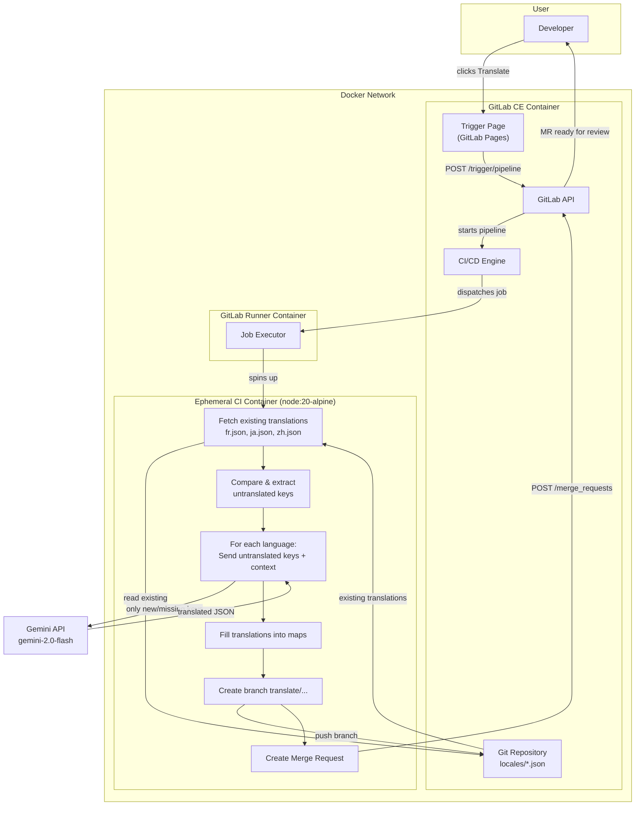
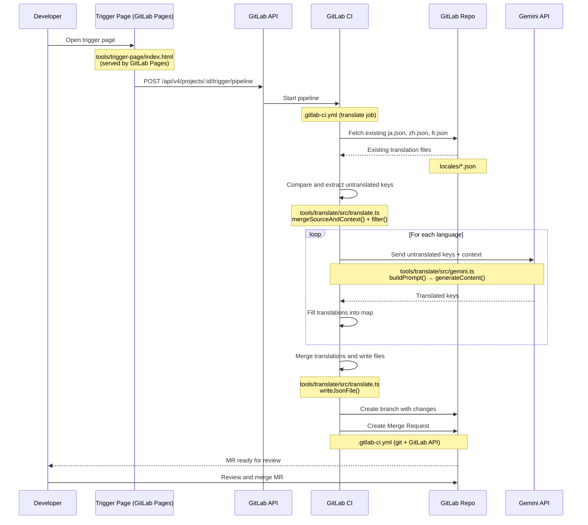

# GitLab + Gemini Auto-Translation

Automatic context-aware translation: Push `en-US.json` to GitLab, get translated files in seconds.

## How It Works

```
Push en-US.json → GitLab Pages updates trigger UI
Click "Translate" on trigger page → GitLab CI → Gemini API → Merge Request with fr.json, ja.json, etc.
```

**Key features:**
- Context-aware translations using Gemini AI
- Static trigger page hosted on GitLab Pages (no separate server)
- Only translates new/missing keys (cost-efficient)
- Creates Merge Requests for review before merging

---

## Quick Start

### Step 1. Configure environment

```bash
cp .env.template .env
nano .env  # Set GITLAB_ROOT_PASSWORD and GEMINI_API_KEY
```

### Step 2. Start the Docker containers

```bash
docker compose up -d
```

Wait 2-3 minutes for GitLab to initialize. You can check progress with `docker logs -f gitlab`.

### Step 3. Create a project in GitLab

1. Open https://gitlab.local:8081
2. Login: `root` / your password from `.env`
3. Create a new project (e.g. `translation-demo`)

### Step 4. Register the GitLab Runner

```bash
# Get registration token from GitLab Admin > CI/CD > Runners
docker exec -it gitlab-runner gitlab-runner register
```

When prompted:
- **GitLab URL**: `https://gitlab.local:8081`
- **Registration token**: from the GitLab admin page
- **Executor**: `docker`
- **Default image**: `node:20-alpine`

### Step 5. Add the Gemini API key as a CI/CD variable

1. Go to your project > Settings > CI/CD > Variables
2. Add a new variable:
   - **Key**: `GEMINI_API_KEY`
   - **Value**: your Gemini API key
   - **Protected**: No (so it works on all branches)
   - **Masked**: Yes

This is required because the CI translate job runs inside an ephemeral container that cannot read the host `.env` file.

### Step 6. Push the project to GitLab

Add translation source files and push to your GitLab project:

**`locales/en-US.json`** - Your translation strings
```json
{
  "submit": "Submit",
  "cancel": "Cancel",
  "welcome": "Welcome to our app"
}
```

**`locales/en-US.context.json`** - Context for better translations
```json
{
  "submit": "Primary action button on forms",
  "cancel": "Button to close dialogs without saving",
  "welcome": "Greeting shown on homepage"
}
```

```bash
git add .
git commit -m "Initial commit with translation files"
git push origin main
```

This triggers the `pages` job in CI, which deploys the trigger page to GitLab Pages.

### Step 7. Create a Pipeline Trigger Token

1. Go to your project > Settings > CI/CD > Pipeline triggers
2. Click **Add trigger** and give it a description (e.g. "Translation trigger page")
3. Copy the token — you'll need it in the next step

### Step 8. Open the trigger page and configure

1. Open the trigger page at `http://gitlab.local:8084/<group>/<project>` (e.g. `http://gitlab.local:8084/root/translation-demo`)
2. The **Settings** panel will be expanded on first visit. Fill in:
   - **GitLab URL**: `https://gitlab.local:8081`
   - **Project ID**: your project's numeric ID (visible on the project homepage)
   - **Pipeline Trigger Token**: the token from Step 7
   - **Ref / Branch**: `main`
3. Click **Save Settings** (stored in your browser's localStorage)

### Step 9. Trigger translation

1. Verify the **Source Keys** table shows your `en-US.json` keys
2. Set **Target Languages** (default: `fr,ja,zh-Hant-HK`)
3. Click **Translate**
4. The page shows a link to the triggered pipeline — click it to monitor progress
5. When the pipeline completes, a **Merge Request** appears in your project with the translated files
6. Review the MR and merge

### Running a translation after adding new keys

1. Add new keys to `locales/en-US.json` (and optionally `locales/en-US.context.json`)
2. Push the changes — the `pages` job updates the trigger page automatically
3. Open the trigger page — you'll see the updated source keys
4. Click **Translate** — only the new/missing keys are sent to Gemini (existing translations are preserved)
5. Review and merge the new MR

---

## Translation Files

### `en-US.json` - Translation Map

Your source strings, typically extracted by i18n tools:

```json
{
  "submit": "Submit",
  "cancel": "Cancel",
  "errorTimeout": "Connection timed out. Please try again.",
  "itemCount": "{count} items"
}
```

### `en-US.context.json` - Context File

Context helps Gemini make better translation decisions:

```json
{
  "submit": "Primary action button on forms",
  "cancel": "Button to close dialogs without saving",
  "errorTimeout": "Error message when API fails, tone should be apologetic",
  "itemCount": "Shows item count in cart, {count} is a placeholder"
}
```

**Context is optional** - strings without context still get translated, just with less accuracy.

### Missing Context Warnings

When CI detects keys without context, it logs warnings:

```
--- Missing Context Warning ---
The following 2 keys have no context:
  - newKey
  - anotherKey
Add context to en-US.context.json for better translation quality.
```

Translation still proceeds (soft mode).

---

## Configuration

### Environment Variables

| Variable | Description | Required |
|----------|-------------|----------|
| `GEMINI_API_KEY` | Your Gemini API key | Yes |
| `TARGET_LANGUAGES` | Languages to translate to (e.g., `fr,ja,zh-Hant-HK`) | Yes |
| `GITLAB_ROOT_PASSWORD` | GitLab root password | Yes |

### Getting a Gemini API Key

1. Go to https://aistudio.google.com/app/apikey
2. Create a new API key
3. Add to `.env` file

---

## Project Structure

```
.
├── docker-compose.yml      # GitLab + GitLab Runner
├── .env.template           # Configuration template
├── .gitlab-ci.yml          # CI pipeline for translation
├── setup.sh                # Initial setup script
├── locales/
│   ├── en-US.json          # Source translation strings
│   ├── en-US.context.json  # Context for better translations
│   ├── fr.json             # Generated: French translations
│   ├── ja.json             # Generated: Japanese translations
│   └── zh-Hant-HK.json     # Generated: Chinese (Traditional) translations
└── tools/
    ├── translate/          # TypeScript translation tool
    │   ├── package.json
    │   ├── tsconfig.json
    │   └── src/
    │       ├── index.ts    # Entry point
    │       ├── translate.ts # Core logic
    │       ├── gemini.ts   # Gemini API wrapper
    │       └── types.ts    # TypeScript types
    └── trigger-page/       # Static UI served by GitLab Pages
        └── index.html      # Trigger page (settings + source keys + pipeline trigger)
```

### File Descriptions

| File | Function |
|------|----------|
| `docker-compose.yml` | Defines the Docker services: GitLab CE (git hosting + CI engine) and GitLab Runner (executes CI jobs) |
| `.env.template` | Template for environment variables: `GITLAB_ROOT_PASSWORD`, `GEMINI_API_KEY`, `TARGET_LANGUAGES` |
| `.gitlab-ci.yml` | CI pipeline definition — `pages` job deploys trigger UI to GitLab Pages, `translate` job runs the translation tool and creates a Merge Request |
| `setup.sh` | One-time setup script: copies `.env.template`, validates API key, starts Docker containers |
| `locales/en-US.json` | Source English strings (key-value map) — the single source of truth for all translations |
| `locales/en-US.context.json` | Context descriptions for each key — helps Gemini choose accurate translations |
| `locales/{lang}.json` | Generated translation files (e.g. `fr.json`, `ja.json`) — output of the translation pipeline |
| `tools/translate/src/index.ts` | CLI entry point — reads environment variables, resolves file paths, calls `translate()`, prints summary |
| `tools/translate/src/translate.ts` | Core translation orchestrator — reads source and existing translations, compares keys, sends only new/missing keys to Gemini, merges results, writes output files |
| `tools/translate/src/gemini.ts` | Gemini API wrapper — builds translation prompts with key/value/context, calls `generateContent()`, parses JSON response |
| `tools/translate/src/types.ts` | TypeScript type definitions: `TranslationMap`, `ContextMap`, `MergedEntry`, `TranslateOptions`, `TranslationResult` |
| `tools/trigger-page/index.html` | Static single-page web UI hosted by GitLab Pages — displays source keys, stores GitLab connection settings in localStorage, triggers translation pipeline via Pipeline Trigger API |

---

## Commands

```bash
# Start GitLab
docker compose up -d

# Stop GitLab
docker compose down

# View GitLab logs
docker logs -f gitlab

# View Runner logs
docker logs -f gitlab-runner

# Run translation locally (for testing)
cd tools/translate
npm install
GEMINI_API_KEY=your_key TARGET_LANGUAGES=fr,ja npm run translate
```

---

## Memory Usage

| Service | Memory | Notes |
|---------|--------|-------|
| GitLab | ~1.5-2GB | Main service |
| GitLab Runner | ~128MB | Runs CI jobs |
| **Total** | **~2GB** | Much lighter than before |

---

## Troubleshooting

### GitLab not starting

```bash
docker logs gitlab
# Wait for "Reconfigured" messages (2-3 minutes)
```

### Runner not picking up jobs

```bash
# Check runner status
docker exec gitlab-runner gitlab-runner list

# Re-register if needed
docker exec -it gitlab-runner gitlab-runner register
```

### Translation failing

```bash
# Check CI job logs in GitLab UI
# Or test locally:
cd tools/translate
npm run translate
```

---

## Translation Input Format

The i18n scanner extracts translation keys and their context from your source code into a single JSON file. Each key maps to a `{ value, context }` object — this is what Gemini receives per key to produce context-aware translations:

```json
{
  "submit": { "value": "Submit", "context": "Primary action button on forms" },
  "cancel": { "value": "Cancel", "context": "Button to close dialogs without saving" },
  "welcome": { "value": "Welcome {userName}", "context": "Greeting shown on homepage" }
}
```

| Field | Description |
|-------|-------------|
| `value` | The source English string to translate |
| `context` | Description of how/where the string is used — helps Gemini pick the right translation |

Context is written by developers in the source code using i18n annotations. The scanner extracts both the string and its context together.

---

## Architecture

### System Diagram



### Sequence Diagram



### Pipeline Stages

| Stage | Description | File(s) |
|-------|-------------|---------|
| **Deploy (Pages)** | On every push, copies `index.html` and source locale files to GitLab Pages. The trigger page is updated automatically. Does not run when pipeline is triggered via API. | `.gitlab-ci.yml` (`pages` job), `tools/trigger-page/index.html` |
| **Trigger** | Developer clicks the Translate button on the trigger page hosted by GitLab Pages. The page calls the Pipeline Trigger API directly from the browser. This is the only entry point — translation is never auto-triggered by git push, to control Gemini API costs. | `tools/trigger-page/index.html` |
| **Dispatch** | GitLab CI engine dispatches the translate job to the Runner, which spins up an ephemeral `node:20-alpine` container. | `.gitlab-ci.yml` |
| **Fetch existing** | For each target language, reads the existing translation file (e.g. `fr.json`) from the repository. Returns `{}` if the file doesn't exist yet. | `tools/translate/src/translate.ts` — `readJsonFile()` |
| **Compare & extract** | Merges source keys with context, then compares against existing translations. Only keys that are missing from the existing file are marked for translation. | `tools/translate/src/translate.ts` — `mergeSourceAndContext()`, `entries.filter()` |
| **Translate** | For each language, sends only the untranslated keys (with their values and context) to the Gemini API. Languages with no new keys are skipped entirely. | `tools/translate/src/gemini.ts` — `buildPrompt()`, `translate()` |
| **Merge & write** | Merges new translations over existing ones (`{ ...existing, ...new }`), removes keys that no longer exist in source, and writes the output file. | `tools/translate/src/translate.ts` — `writeJsonFile()` |
| **Branch & MR** | Creates a new git branch (`translate/YYYYMMDD-HHMMSS`), commits the changed locale files, pushes the branch, and creates a Merge Request via the GitLab API with `remove_source_branch=true`. | `.gitlab-ci.yml` — git commands + `curl` to GitLab API |
| **Review** | Developer receives the MR, reviews the translation diff, and merges. | GitLab UI |

---

## Version

**Version:** 4.0.0
**Changes from 3.x:**
- Migrated trigger page from standalone Node.js server to GitLab Pages
- Removed `server.ts` — page calls GitLab Pipeline Trigger API directly
- Added differential translation (only new/missing keys sent to Gemini)
- Translation creates Merge Requests instead of direct pushes

---

**Need help?** Check the troubleshooting section or open an issue.
