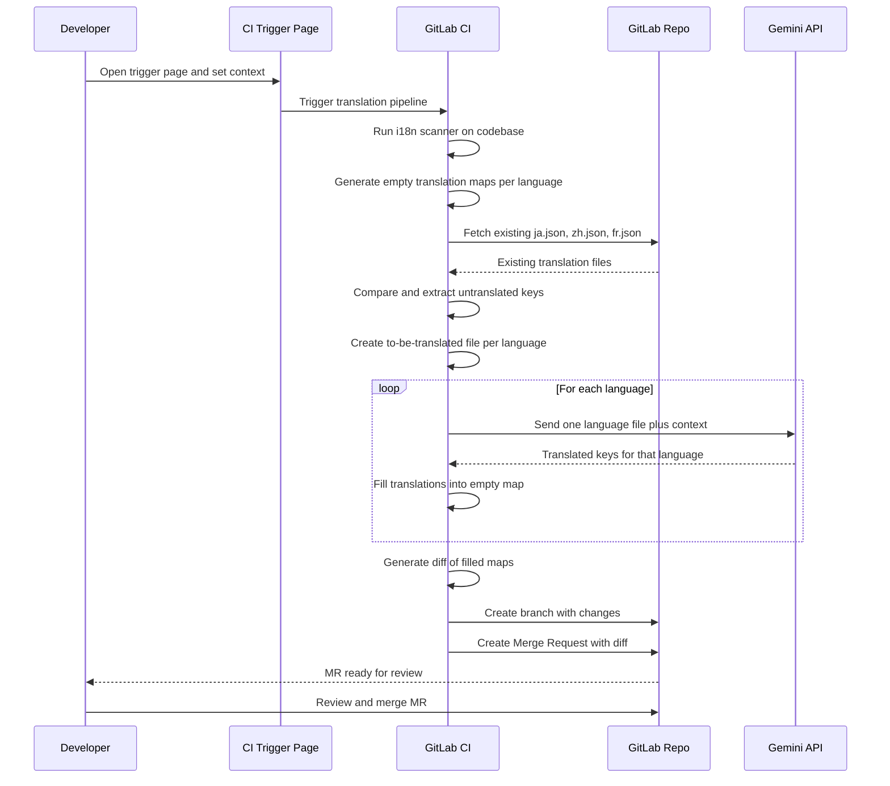

# GitLab + Gemini Auto-Translation

Automatic context-aware translation: Push `en-US.json` to GitLab, get translated files in seconds.

## How It Works

```
Push en-US.json + en-US.context.json → GitLab CI → Gemini API → fr.json, ja.json, etc.
```

**Key features:**
- Context-aware translations using Gemini AI
- Runs in GitLab CI (no extra servers needed)
- TypeScript translation tool

---

## Quick Start

### 1. Start GitLab

```bash
cp .env.template .env
nano .env  # Set GITLAB_ROOT_PASSWORD and GEMINI_API_KEY

docker compose up -d
```

Wait 2-3 minutes for GitLab to initialize.

### 2. Create a project in GitLab

- Open https://gitlab.local:8081
- Login: `root` / your password from `.env`
- Create a new project

### 3. Add translation files

Copy these sample files to your GitLab project:

**`locales/en-US.json`** - Your translation strings
```json
{
  "submit": "Submit",
  "cancel": "Cancel",
  "welcome": "Welcome to our app"
}
```

**`locales/en-US.context.json`** - Context for better translations
```json
{
  "submit": "Primary action button on forms",
  "cancel": "Button to close dialogs without saving",
  "welcome": "Greeting shown on homepage"
}
```

**`.gitlab-ci.yml`** - CI pipeline (copy from this repo)

### 4. Register the GitLab Runner

```bash
# Get registration token from GitLab Admin > CI/CD > Runners
docker exec -it gitlab-runner gitlab-runner register
```

### 5. Push and watch the magic

```bash
git add .
git commit -m "Add translations"
git push
```

GitLab CI will automatically:
1. Merge `en-US.json` with context
2. Call Gemini API for translations
3. Commit `fr.json`, `ja.json`, etc. back to repo

---

## Translation Files

### `en-US.json` - Translation Map

Your source strings, typically extracted by i18n tools:

```json
{
  "submit": "Submit",
  "cancel": "Cancel",
  "errorTimeout": "Connection timed out. Please try again.",
  "itemCount": "{count} items"
}
```

### `en-US.context.json` - Context File

Context helps Gemini make better translation decisions:

```json
{
  "submit": "Primary action button on forms",
  "cancel": "Button to close dialogs without saving",
  "errorTimeout": "Error message when API fails, tone should be apologetic",
  "itemCount": "Shows item count in cart, {count} is a placeholder"
}
```

**Context is optional** - strings without context still get translated, just with less accuracy.

### Missing Context Warnings

When CI detects keys without context, it logs warnings:

```
--- Missing Context Warning ---
The following 2 keys have no context:
  - newKey
  - anotherKey
Add context to en-US.context.json for better translation quality.
```

Translation still proceeds (soft mode).

---

## Configuration

### Environment Variables

| Variable | Description | Required |
|----------|-------------|----------|
| `GEMINI_API_KEY` | Your Gemini API key | Yes |
| `TARGET_LANGUAGES` | Languages to translate to (e.g., `fr,ja,zh-Hant-HK`) | Yes |
| `GITLAB_ROOT_PASSWORD` | GitLab root password | Yes |

### Getting a Gemini API Key

1. Go to https://aistudio.google.com/app/apikey
2. Create a new API key
3. Add to `.env` file

---

## Project Structure

```
.
├── docker-compose.yml      # GitLab + GitLab Runner
├── .env.template           # Configuration template
├── .gitlab-ci.yml          # CI pipeline for translation
├── locales/
│   ├── en-US.json          # Source translation strings
│   ├── en-US.context.json  # Context for better translations
│   ├── fr.json             # Generated: French translations
│   ├── ja.json             # Generated: Japanese translations
│   └── zh-Hant-HK.json     # Generated: Chinese (Traditional) translations
└── tools/
    └── translate/          # TypeScript translation tool
        ├── package.json
        ├── tsconfig.json
        └── src/
            ├── index.ts    # Entry point
            ├── translate.ts # Core logic
            ├── gemini.ts   # Gemini API wrapper
            └── types.ts    # TypeScript types
```

---

## Commands

```bash
# Start GitLab
docker compose up -d

# Stop GitLab
docker compose down

# View GitLab logs
docker logs -f gitlab

# View Runner logs
docker logs -f gitlab-runner

# Run translation locally (for testing)
cd tools/translate
npm install
GEMINI_API_KEY=your_key TARGET_LANGUAGES=fr,ja npm run translate
```

---

## Memory Usage

| Service | Memory | Notes |
|---------|--------|-------|
| GitLab | ~1.5-2GB | Main service |
| GitLab Runner | ~128MB | Runs CI jobs |
| **Total** | **~2GB** | Much lighter than before |

---

## Troubleshooting

### GitLab not starting

```bash
docker logs gitlab
# Wait for "Reconfigured" messages (2-3 minutes)
```

### Runner not picking up jobs

```bash
# Check runner status
docker exec gitlab-runner gitlab-runner list

# Re-register if needed
docker exec -it gitlab-runner gitlab-runner register
```

### Translation failing

```bash
# Check CI job logs in GitLab UI
# Or test locally:
cd tools/translate
npm run translate
```

---

## Architecture



### Flow Summary

1. **Trigger** - Developer opens CI trigger page and sets project context
2. **Scan** - CI runs i18n scanner to extract translation keys from codebase
3. **Generate** - CI creates empty translation maps for each target language
4. **Compare** - CI fetches existing translations and extracts only untranslated keys
5. **Translate** - For each language, CI sends untranslated keys to Gemini API
6. **Fill** - CI fills translated values back into the empty maps
7. **MR** - CI creates a branch and Merge Request with the diff
8. **Review** - Developer reviews and merges the MR

---

## Version

**Version:** 3.0.0
**Changes from 2.x:**
- Replaced Weblate with Gemini AI
- Removed PostgreSQL, Redis, Nginx, webhook service
- Added context-aware translations
- Simplified to just GitLab + GitLab Runner

---

**Need help?** Check the troubleshooting section or open an issue.
